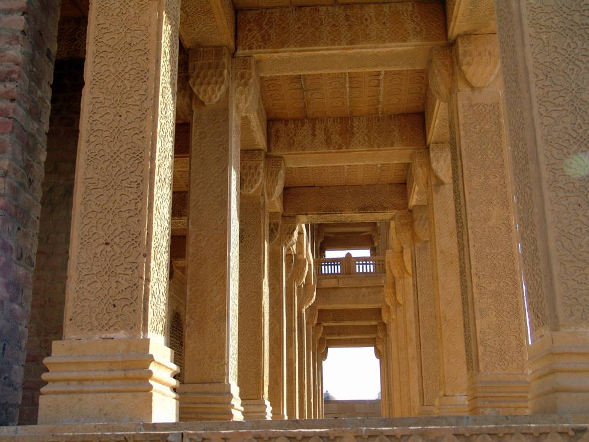

## Comments (4)

**Kahn** - August 31, 2007  8:35 AM

Your pics are wonderful. Pakistan has so much history and tourist sites; its a pity tourism has not been developed as compared with other developed countries. Many parts of Pakistan seem to stand still in time. Perhaps publicity is lacking. (I stumbled on the Karachi 4x4 club as I am an Off Roader). I believe security is the main reason for foreigners to shun driving into or visiting Pakistan, including lack of facilities. I have always dreamed of driving around Pakistan as that would be going down memory lanes (I spent a few years of my childhood there).

---

**Munira** - October 25, 2008  8:09 PM

really lovely pictures! i went to Makli myself a couple of weeks ago (for the first time i am ashamed to say, since i LIVE in Karachi)....and took almost the exact same picture as this...only from the other side...! it's distressing to see the tombs crumbling though, and hear about theft (of carved tiles etc) and the lack of concern about preservation. considering it's supposed to be the largest necropolis in the world, our government, sadly, does very little to preserve it.

---

**MUHAMMAD FAIZAN** - April 30, 2009  9:25 PM

I KNEW KENJHER LAKE AND MAKLI'S GRAVE YARD FROM CHILDHOOD BUT WENT AT THE AGE OF 21 AND ONLY AT LAKE ALAS I WISHED TO GO TOMBS AND HALIJI LAKE

---

**Ali Hasan** - March  6, 2010 11:03 AM

I went to makli a couple of weeks ago. was facinated by the sight, it was was hard to belive that they built such structures 100`s of years ago.
some tombs are breath takingly beautiful. but little is done by the government to preserve them.

---

