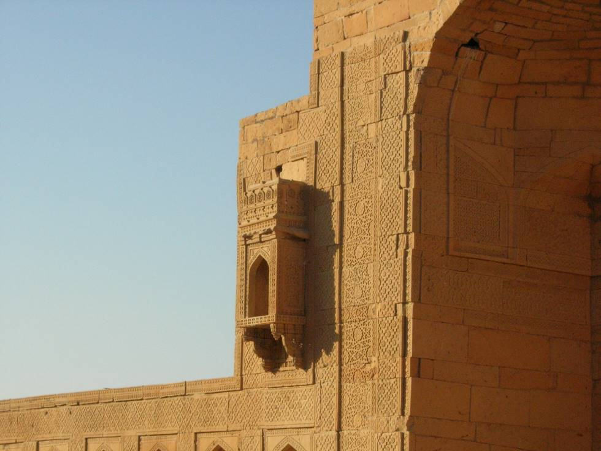

## Comments (1)

**Salman** - March 15, 2009 10:24 PM

Yeah, those were just eye-catching......sadly though, our entertainers told us that the locals had "stolen" or damaged a lot of them in the "process". They said many of these motifs were actually present in the drawing rooms of some local political figures. [this is a World Heritage Site in my Pakistan].

---

