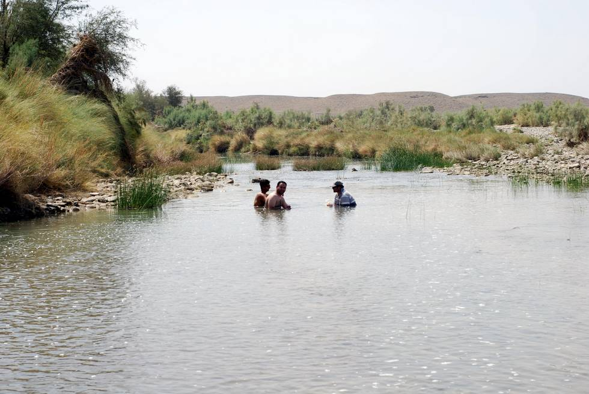

## Comments (2)

**Asif Nizamani** - June  6, 2008 10:26 PM

Must have felt like being in heaven considering the sweltering hot it must have been !!!
May i know which river it was ?

---

**Ibad ul Haque** - July 29, 2008 11:32 PM

You people make me say something......

Nicely taken photographs, no doubt about this, all credit goes to photographer but it seems that the scenic beauty of this Place also speaks by itself and the different landscape from rest of the Pakistan also has an impact.

One should proud of being citizen of such country....

I also owns a 4x4 but lives other part of the country (Islamabad) where mountains challenge you. I have solo trips to Deosai plan (Northern areas), Gitti das (babusar pass, top of Kaghan velly- making road to chillas)... Siri paia (Shogran). I have snaps to share if anyone is interested.

I will love to join group who are interested taking chalenges in this part of country..

With best regards

Ibad ul Haque

---

