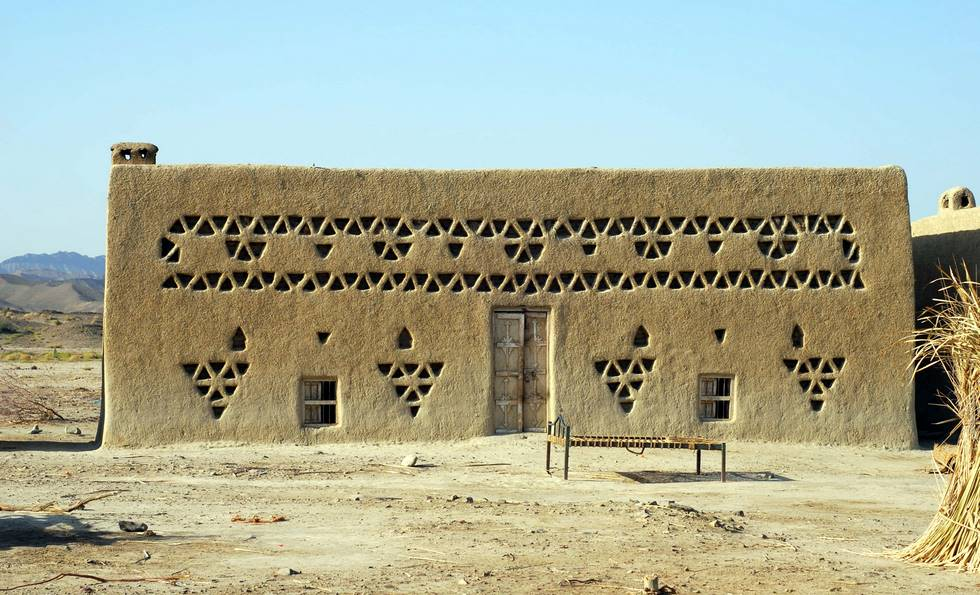

## Comments (2)

**David from Texas** - June  1, 2008 10:20 PM

I really don't expect an answer,
But,
I wonder,
if there is a reason for the geo-designs other than decoration...???

hmmm

**Taimur Mirza** - June  2, 2008 12:07 PM

David,
The practical side for these 'vents' is the sheer extreme in temperatures: summer highs up to 50C and winter lows below 0 C. If you notice the windows are located closer to the ground allowing cooler air to pass in while larger area for hot air near the ceiling to escape out keeping the structure cool from inside. The walls are about 2 feet thick plastered with clay and straw for insulation. Adaptability my friend, and thank you for the kind words.

