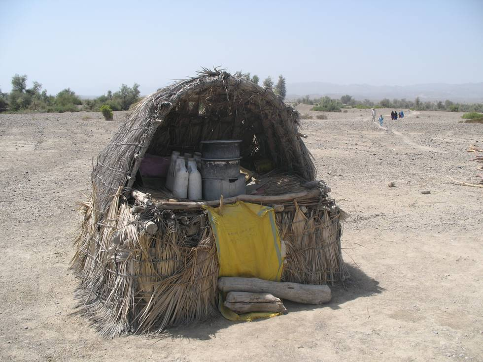

## Comments (1)

**David from Texas** - June  1, 2008 10:32 PM

To a spoiled Old TeXas Fisherman, I cannot imagine a day without 24-Hour Air Conditioned Fully Stocked
Stores full of COLD Liquids to drink & tasty (and junk) foods, that even most of the poorest-of-the-poor can
afford to do business at...

I pray that I am not comming across as bragging~~~NEVER...!!!

It's just that I almost cannot comprehend the daily life that you guys endure to bring Aid & Compassion to remote areas that many do not even know exists.

A Very Wise Man Once Said/Says, "When you do it unto the Least of these, you do it as unto Me"...

Thank You, Guys, for All That You Do,

From A Dirty Old TeXas Fisherman

---

