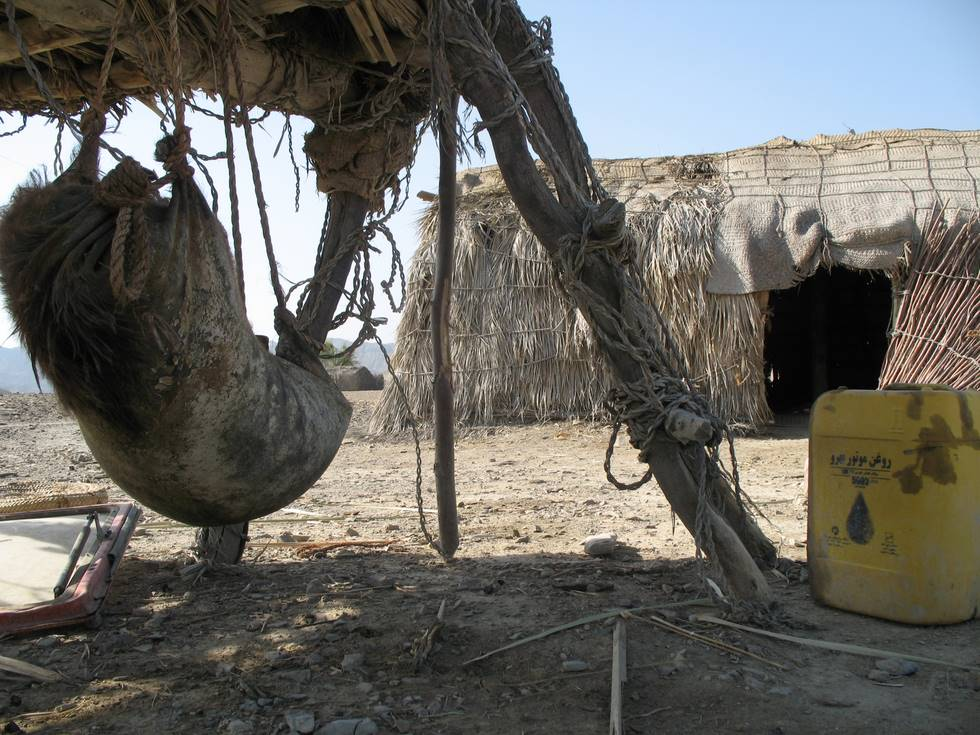

## Comments (1)

**David from Texas** - June  1, 2008 10:13 PM

I have Never seen anything other than indoor faucets connected to underground pipes leading to unlimited underground wells & above-ground water-towers.
Even the Poorest of the Poor here are not without an unlimited supply of fresh clean running water, for a cost of almost Nothing.
Thank You for letting me travel with you and for bringing me closer to that which I could never imagine.
You are indeed Angels of Mercy, and may God Bless you in All you do, and keep your Spirits High and your Quest continually On-going.......!!!

Gratitude From an Old TeXas Fisherman.......................................

