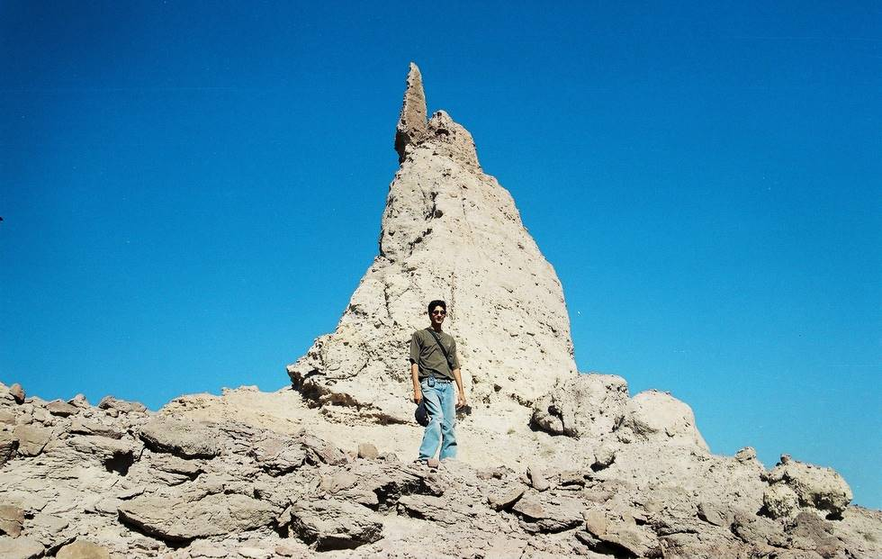

Abid standing in front of Neza-e-Sultan.

## Comments (1)

**KARAM TALPUR** - January 19, 2009  1:40 PM

CAN SOMEBODY PLS TELL WHERE THIS MOUNTAIN IS EXACTLY LOCATED? AND WHAT IS THE SIGNIFICANCE OF ITS NAME?

