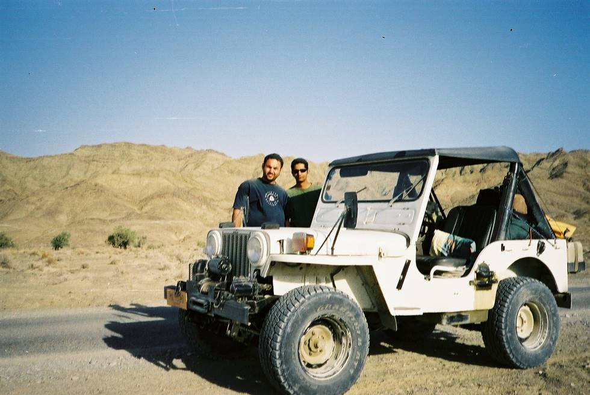

Ahsan and KO standing next to the most powerfull jeep.

## Comments (5)

**Imad** - July 18, 2003 10:10 PM

THe white jeep can never lose!!!

---

**ching** - October  7, 2004  3:05 PM

is that all you got?you call that wimpy jeep,powerfull????? check-out nasfor,and see what the 4x4 means.
complete with winch,lockers..... do it hardcore baby!!!!

---

**Desiree** - December 29, 2005 10:50 AM

Look at those hot studs 4-wheeling in through the desert!

---

**Kahn** - August 31, 2007 12:42 PM

In many photos, this jeep has been mentioned as the most powerful. What is the cc and is it Turbo charged?. A Toyota Landcruiser of 2446cc, short wheel base could negotiate any mountains this jeep has done, even half a meter of snow, a meter of river water and wheels sunk halfway in tropical mud. That is not powerful but normal with skillful driving. Perhaps more specifications on the mentioned Jeep would be helpful for other enthusiasts and potential owners.

---

**KO** - August 31, 2007  3:23 PM

Kahn, you can see the Jeep specs here: <http://offroadpakistan.com/founder_members/khalid_omar.html>

It's got a Toyota 2.4 Turbo Diesel engine, but it's the driver which makes it powerful, as u said!

---

