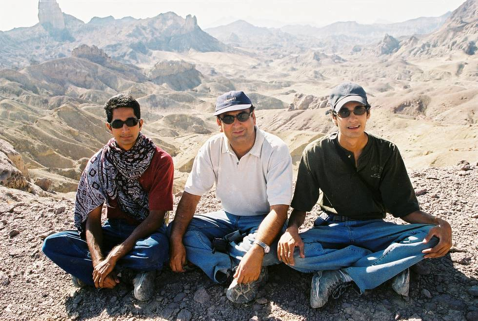

Sitting on top of the world at Neza-e-Sultan.

## Comments (2)

**Aamir Bilal Sheikh** - July  2, 2003  6:16 PM

The sites are execellent one must explore more of this area in more depth to know how many people passed from this location thousands of years ago and what actually happened while travelling through this rough terrains when communications were almost zero compare to as of today.

**Salman** - July  5, 2003 12:43 AM

Khlaid and Ahmed Omar are chilling out while Abid is preparing to levitate for a better view!!!

