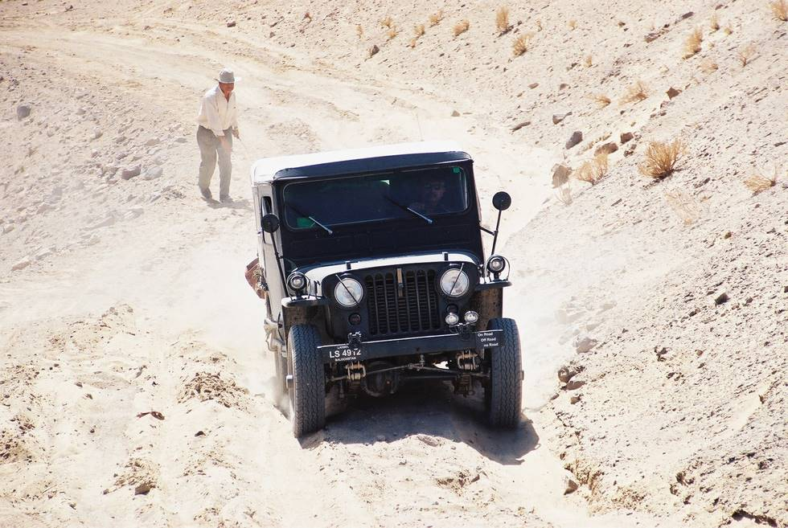

This slope was tougher than it appears in the picture. This jeep had a tough time making it up, and had to shed it's passenger for the weight relief.

## Comments (1)

**Jeeper** - October  8, 2004  2:11 PM

The shedded passenger also seems to have applied the "low range" gears for the uphil trek.

