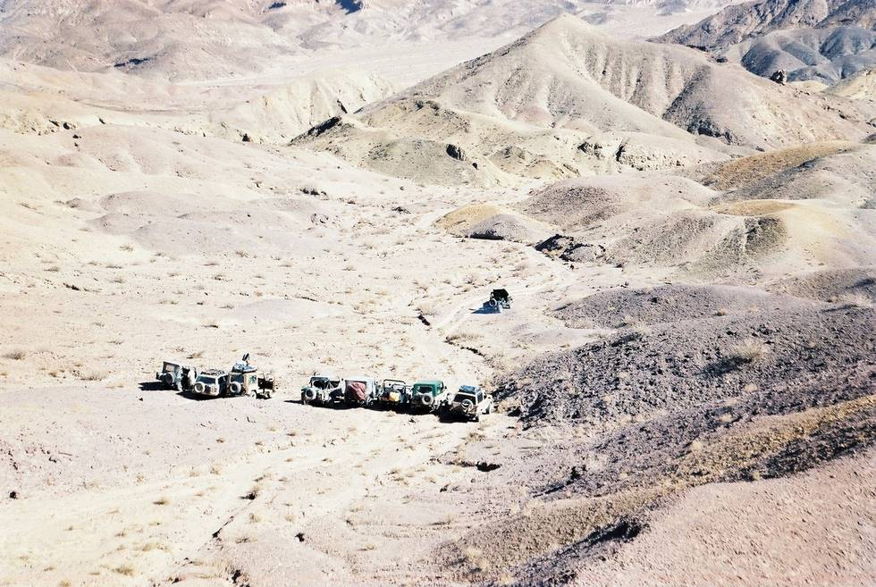

Photo by AO.

## Comments (4)

**Haydur Agha** - October  3, 2003  1:24 AM

Excuse me for being an ignorant geographically illiterate person... but where exactly is the "neza" in this picture?

**KO** - October  3, 2003  1:35 AM

That's a very good question. The Neza is behind the jeeps, this picture is from a small hill next to the Neza. All the jeeps were getting lined up for a group photo with Neza-e-Sultan in the background. Or as the caption says, Group photo from Neza-e-Sultan, not of it.

**Naveed Zafar** - November 27, 2005 11:20 PM

wow..! yet another mind blowing picture from this site. I really like the way it is.

**Imran Khan** - March  3, 2010 12:04 PM

These are some really nice pics...great uploads, it shows the lighter side of Pakistan !

