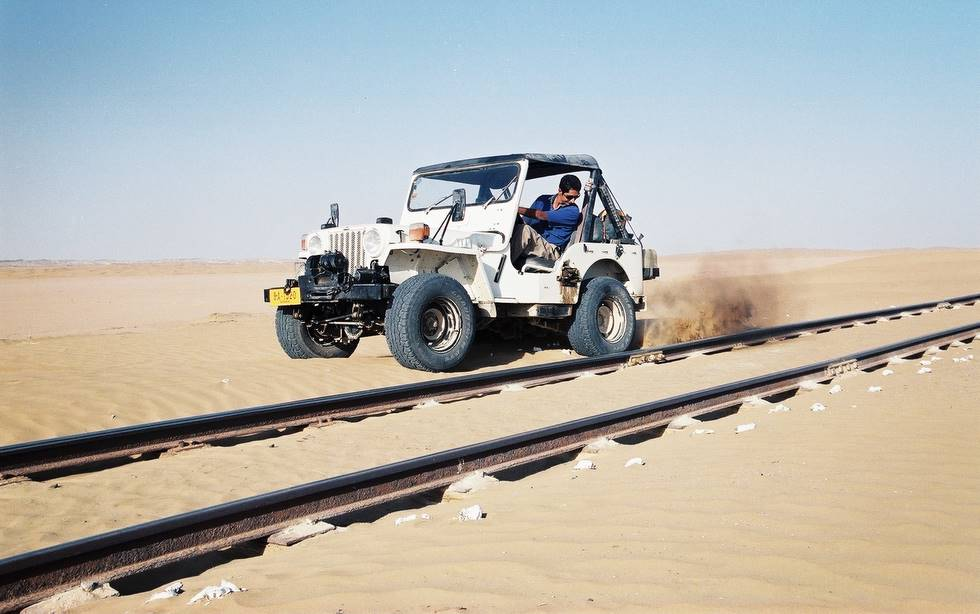

In the sand.

## Comments (10)

**Imad** - July 18, 2003 10:04 PM

Abay dekh sala kacha phek ria hai! :p

---

**Amna** - July 18, 2003 11:41 PM

Why aren't you driving on the road? beautiful surroundings and nice t-shirt.

---

**Genius** - July 14, 2005  2:18 AM

Well, learn to drive first. you are not worthy for this jeep. And look in front rather than looking to your tyre.

---

**Harpreet Shergill** - July 27, 2005  6:52 PM

Well, seeing my first love ( Jeep ) doing hard excercise in a desert is indeed painful, but that is what it was designed for.

---

**Omar Husain** - January 20, 2006  3:02 AM

Hey genius, he's driving it pretty well, i want to see you drive it.

---

**Umair Bashir** - January 29, 2006  4:01 PM

Achaaa...! ab pata chala pakistan main railway lines dhamake se kon udata hai...

---

**farooq** - June  9, 2008  1:52 AM

salam
hope u r ok.if u want 2look good &power full willy come in rawal pindi.AL AWAN AUTO MOBILE.FAROOQ AWAN

---

**irfan** - November  9, 2009  1:44 AM

bhai itni achi jeep pay rang chutipay ka kyun kara dia. white rang say puri jeep ki m.c hogae

---

**kdfjfdskj** - November 24, 2011 10:10 AM

Good picture

---

**Abdul musaver** - March  8, 2012  9:36 PM

Salam bhai muje b ek chahiye aur is ki qeemat kitni hai plz replay me

---

