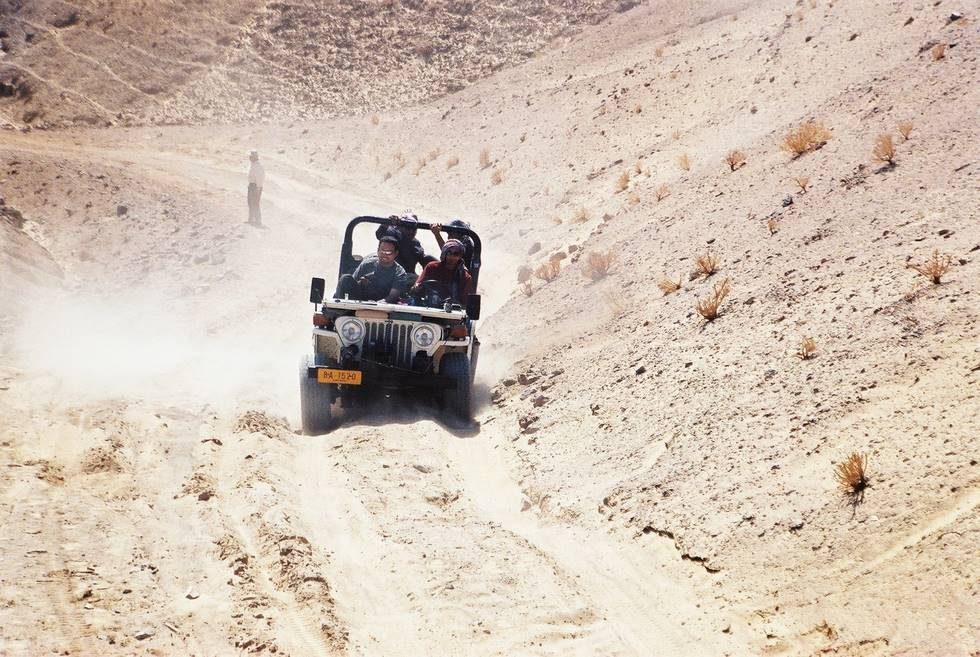

White Jeep clawing away at the loose sand for traction. This path was steeper than it appears, and two jeeps got stuck here.

## Comments (3)

**Jeeper** - October  8, 2004  2:50 PM

the shedded passenger still lurks in the background....................... did he make it to the top unaided??

---

**Jeeper** - October  8, 2004  2:52 PM

dont tell me you guys had to use a tow strap on him too...........................

---

**Yaseen** - October 11, 2004  2:45 PM

The offloaded passenger in the background was not actually offloaded but he was guiding drivers up the slope. He happens to be the same person who underwent an angioplasty and then a couple of weeks later on a hunting trip shot a hare and then ran after it!

---

