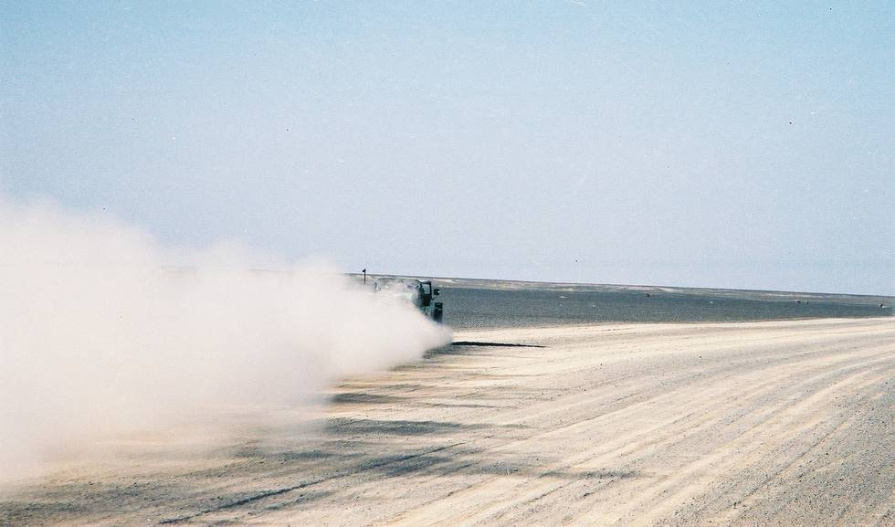

Doc's CJ-7 racing along in the arid desert between Dalbandin and Noukundi.

## Comments (6)

**Saad Ahmad** - December 25, 2003  9:05 AM

Fascinating....
A word of caution - it's quite easy to flip over a jeep when racing over a salt plain, I once had the odd experience of watching a chopper land in the middle of nowhere to medevac a couple of guys who had flipped over their Wrangler...

---

**Imad** - December 25, 2003 11:35 AM

Ahem ahem, 120 km/h sounds a bit too optimistic for a jeep that was already in bad need of a new engine when this picture was taken. Come on guys, it must have been more like 85-90 km/h. I have seen the video - there's no way anyone was going that fast, especially with the Cherokee in tow.

---

**KO** - January  2, 2004  5:12 PM

120km per hour is actually an euphemism for "the fastest speed possible the jeep could attain in 5th gear at top RPM". And mind you, on tarmac it's been clocked at 140km and acclerating still. This was when the vehicles doing the clocking (a CJ7 and a double cabin Hilux) had to slow down due to excessive 'tire shake' and high speed handling worries. You are right though, on this terrain the speed was below a 100km throughout.

---

**Imad** - January  7, 2004 11:38 PM

I thought so. Yaseen was clocked at ~150km/h in the CJ7 when it still had the 3B. This was on the way back from Quetta, with Doc doing the clocking from his Civic.

---

**Taimur Mirza** - January  9, 2004  8:47 PM

Imad get your eyes checked this is not the white Jeep at 120 kms/hour its Doc's CJ

---

**Imad** - January 13, 2004  2:44 AM

Scheisse!! I stand corrected! It IS Doc's CJ!!

---

