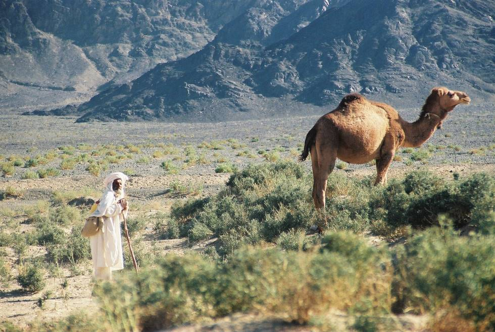

The old man with his Camel
testing..

## Comments (3)

**Masood Ahmed** - October 26, 2004  4:35 PM

Its just there in the outback of Pakistan. Adventure, thrill, challenge and lots and lots of hospitality.The story is told in the picture. Old man with his camel against the backdrop of Gray Mountains. O! the adventure soul may you always remain restless!

**Imran Khan** - March  3, 2010 12:08 PM

This pic is an inspiration....i'm gonna visit this place soon !
Where exactly is Naza e Sultan located?

**Kiana** - August  7, 2011 12:21 AM

This site is like a classorom, except I don't hate it. lol

