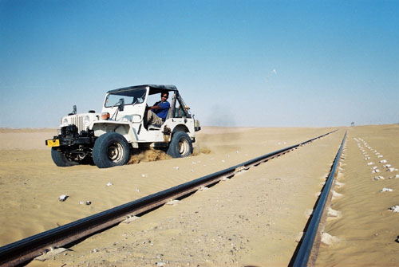

The most powerful jeep. Update: Now the even more mostest powerful Jeep, with the highest power to weight ratio of any Jeep. See details over here.

## Comments (32)

**Rehan Iqbal** - August 21, 2003  2:52 PM

This does not look to me as the most powerful jeep.
Please contact me to enable me to show you the most powerful jeep, and join the club.

---

**KO** - August 22, 2003  2:39 AM

Its the soon to be Even more powerful jeep actually.

Please post more about yourself at the forums: [<http://offroadpakistan.com/forums/>](http://offroadpakistan.com/forums/)

---

**Fazal Ashfaq** - August 26, 2003 12:44 PM

Haw Haw Haw...I know this dude called Rehan Iqbal who certainly has the most powerful jeep...

---

**Imad** - August 26, 2003 11:58 PM

That caption should actually read, "The most CAPABLE Jeep." All the power in the world won't make a difference if the vehicle can't put it to the ground.

---

**KO** - August 27, 2003 12:35 AM

Well said, Imad! It's a tricky balance of power, weight, size and chutzpah and few vehicles get it just right.
One of the 4x4 magazines in their anniversery issue compared the 10 best vehicles they had ever tested to find the best one. Amongst million dollar Ironman pickups and rock crawling monsters, the bone stock willys jeep was declared the number one offroad vehicle ever.

---

**Imad** - August 27, 2003 12:50 AM

The Willy's can never lose!!!! Offroad only though. Driving these things down the highway is a fulltime white knuckle experience.

---

**Ahsan** - August 29, 2003  3:49 PM

Hell yeah, I remember the drive from Quetta to Karachi. White knuckle alright but so darn sweet and fun!

Can't wait for the "Even more most powerful jeep in the whole wide world"!

For another reliable reference, contact Khan Sahab!

---

**Abid** - August 30, 2003  1:52 AM

I hear the new engine being installed in this jeep is a turbocharged 3.0 1KZ EFI. The other jeep I know with this engine is an extended CJ-7, and does that thing move! I can swear, with it's automatic gearbox it wheelspins wiht every gear change. Imagine all that power under the hood of an M38 with a manual geerbox!

---

**Taimur Mirza** - August 31, 2003 12:18 PM

The most capable Jeep: Imad you want white knuckles, KO you want to quit smoking, Abid you like frozen feet, Ahsan you need a cracked skull, Yaseen you need a broken nose, well all these qualities are embodied in ONE DRIVER and ONE JEEP: Pappu Sahibs 1942, 40 Miles an hour, road or no road, traffic or no traffic, speed bumps or no speed bumps, uphill or downhill, will go where no other vehicle goes, drives with a full 2 rounds of play in the steering wheel, brake activates after pumping 5 times, but NEVER has the Jeep broken down on any of the Trips, so I guess to wrap it up Pappu Sahibs Jeep is the BEST and MOST POWERFUL.

---

**KO** - September  1, 2003  4:10 PM

You are right, but it did break down on the last trip.. twice. I think the secret to its offroading prowess is the flexible axles. I was following it once around a really sharp turn which was impossible to negotiate above 10 miles an hour so I had to slow down. He just went off the road, bounced off a few rocks which would have killed most jeeps right there, bounced off another rock back onto the road and sped off. Me and Raheel just stopped in awe and decided not to follow him any longer as we would end up upside down sooner or later!

This was on the way to Gawadur, where both the guides sitting with him had to be hospitilized. That deserves a story to itself.

---

**Yaseen** - September 10, 2003  2:02 AM

Haha...Yes, I remember that trip. One guide had a broken nosee and the other and broken wrist or elbow. Both made good their escape the same evening and were no where to be seen the next morning!!!

---

**KO** - September 19, 2003 12:20 PM

You forgot to mention that when they arrived at the hotel, they were both literally stricken dumb with terror. We had to revive them, and as soon as they recovered they after a few #%@!#$@#$,s they sped off!

---

**Faheem** - September 19, 2003  2:20 PM

Hi,
Just wanted to say this is a great site and you guys must have had fun on these safaris. I live in Quetta and have visited most these places in Balochistan and this summer we went to the kkh till the china border,khunjarab pass.Drove across the deosai plains and i must say it was once in a life time expiepernce. Certainly like to join your club in any future safaris.
Thanks

---

**KO** - October  6, 2003  1:07 AM

Over the years, many have wondered as to exactly which is the most powerfull jeep. Finally, thanks to Google, we now know [that this IS the most powerful jeep](http://www.google.com/search?hl=en&ie=ISO-8859-1&q=most+powerful+jeep&btnG=Google+Search)! See more about the most powerful jeep at it's [profile page](http://offroadpakistan.com/founder_members/khalid_omar.php).

---

**Salman Ali** - October  8, 2003  1:37 AM

KO's white Jeep (M38) will become the most powerful jeep ever once he installs the 2006 model of the 2L-T in it. Right now his buyer is negotiating with Toyota Corp in Japan for a one-off early release. By the looks of it the deal, will be completed by the time KO's son gets married!!!!

---

**Mir Islam Mustafa** - October 15, 2003  2:49 PM

Its one of the best M38 that Khalid Omer(KO) has and one of the best and interesting sites that i have ever visited, KO's has the most powerful jeep that i have seen yet! as shown in the picture, the nut behind the wheel produces far more torque then the engine it self. The site contains lots of interesting pictures showing a side of pakistan not seen by many. Keep up the good and interesting work.

---

**tanya** - November  2, 2003  8:58 PM

my papa's is the most powerful jeep ever so all of you STUFF it!! :) (:

---

**imad** - November  3, 2003  9:36 PM

Best argument EVAR for teh most powerful jeep!!

---

**KO** - November 25, 2003  1:00 AM

Rehan, while your vehicle is indeed very powerful, it's not a Jeep, therefore it certainly cannot be the 'most powerful jeep'. 8-)

---

**MO** - December  4, 2003  6:12 PM

listen, why don't you guys just talk on the phone??

---

**Aleem** - December  9, 2003 11:06 PM

Am coming to Karachi from USA specially to see this Jeep!

---

**Naveed Zafar** - November 27, 2005 11:25 PM

So finally you ppl managed to understand each others point of view. nice to see this :P

what ever, the picture is nice.

---

**amir khan** - December 11, 2005  8:13 PM

ur jeep looks heavy and truly 4x4 with da radials and the winch am amir 4m india and a big jeep fan ur jeep is good man

---

**Seyit** - April  6, 2006  2:05 AM

With all sort of swapping you shouldn't call the rig "JEEP" as well.So far as I see only the grill and the windshield remain from the jeep. Please beware that Jeeps are born Jeeps.They don't need donors to be transplanted.

---

**Imad** - April 23, 2006  2:35 PM

Seyit,

As far as I remember, the age old adage goes "Jeeps are BUILT, not BOUGHT". This one still retains more factory parts than most, and all improvements are strictly functional. This one's a real no-nonsense machine.

---

**Shon Penn** - October 10, 2007  3:05 AM

No doubt the Willys M38 is the MOST POWERFUL JEEP. Recently this was proven beyond doubt when we went off-roading in the Baja Desert. There was one old M38 in our group and it beat the sh-t out of all the new big SUV's!! I am totally sold out on the M38 and that is going to be my next machine!! (I know it will be a pain in the 'a s s' and surely will end up costing more than a new HUMMER 3!!!!!!!).

---

**hamid omar** - March  9, 2008  1:28 AM

People forget the most poweful jeeps - now the latest is the MOST POWERFUL FORD F1 - for details and phots check out on the website. The truck's first offroad trip was the Goran Gatee one - see pictures of the Ford truck in that folder.

---

**Fazal** - October 11, 2008  9:37 AM

Hamid, aren't you forgetting the vehicle that sailed you through a flooded Pacific Coast Highway and plowed you through three feet of snow over the mountain passes AND drove you through tree trunks ... literally ! Without ever spilling a drop of the margaritas you were enjoying (I mean "ROOH-E-AFZAs", sorry about that) ??? You took the pictures, you mailed them to me. Want me to mail them back to you ??? Shame on you !

---

**balochistan** - October 12, 2008 11:38 PM

@ KO ...Bro da alterations u hav got done on ur willy's is a typical lyari chemisrty of converting a JEEP into a SO Called LAND CRUISER or somthin like tht which is a true disgrace for JEEP ..Da more da jeep is in its original form da more muscle power plus toughness it has ....gettin an 2.4 efi diesel in a willy's is ridiculus look at da size of da jeep man plus getting rocky diff is shit to it kills da jeep thing...i have an M-38 petrol in its true original form n i take it wer ever i feel like goin ..neva got stuck ,my clutch neva slipped, my jeeps leaf spring neva broke althought i hav done xtreme off roadin wid it .. its fantastic ....my advice is if u wana race ur jeep or somthin like tht plz buy a wrangler but mixing japnese scrap wid JEEP is truely shit ...no offense bro jus tellin u my own preception ... Da mechanics in lyari are "lakeer ke fakeer" ...all they kno is 2 things 2400 engine ,daina or rocky ka gear n rocky ka hisa ...lol ....if u guys r so FOnd of heavy diesel engines n empressed by japnese scrap so y dont u guys buy a Land cruiser or somthin y r u simply killin da jeeps charm .lol

tc

---

**Fazal** - October 13, 2008  3:30 AM

Amazing comment !

Although in principle I agree with the view expressed and have on several occasions argued the same with the various conversion fanatics.

I am amazed at the argument coming from someone who himself (or herself, or itself ... who knows) mutilated, nay butchered, a language for his/her/its convenience while hiding behind a pseudonym ... balochistan (read Baluchistan). It is all about convenience. Do you see ? Can you appreciate that ?

Have the decency to tell who you are and express your thoughts without departing from civility.

Happy trails.

---

**Aamir Brohi A.K.A BALOCHISTAN** - October 14, 2008 10:00 PM

i jus xpressed my views, i did not set up a bomb tht il disguise myself.... @ fazl..bro ur basically tryn to say dat da ppl who get HONDA ACCORDS steering wheels installed in ther JEEP's for ther convience so tht da jeep could feel like an ACCORD r tru jeep lovers....LOL taubah ...go get a life man .....do u even kno wat a jeep is or wats it for ???? n BALUCH BALOCH BALOUCH makes no difference ( u can read it n u can understand thts da point ;) ) .....n yeah i wud love to appreciate da ppl in da team who have Land cruiser's, Nissan petrol's, surf's, cherokee's who listen to hotel california ,sip chilled can of heinken, breathn chilled AC air wid ther hands on da steering wheel sittin comfortably n endn up alll fresh fresh afta they reach hingol in 4 5 hours n theyr ready to party...atleast they hav a sense of ther convenience....on da other hand jeeps r meant to feel da terrain, enjoy da off road n not care tht da dashboards screw's will loose or da plastic bumper will fall off .....my Jeep's spare wheel cover sez" MY JEEP WON DA WORLD WAR 2 WTF DID UR SAFARI DO" ...well i could had neva put this cover on if i had my jeep alll alterd wid japnese scrap .....millitary jeeps r not meant for wheel slip ....read bout it n ul know wat theyr worth ... n FAZL (chief justice for so called civility) plz call me if u hav any queries 0346-2757213..

---

**shahbaz khan** - May  1, 2009  5:35 PM

wait for 2 months as i am preparing a cj5 with 1kz with stock diffs.
My ride is a disc brakes one with coil springs in rear.
Gear is of hilux 1999 model with ECT.
Clutch is of double type.
Fuel pump is 5L.

Will soon upload the pics
03002234432

---

