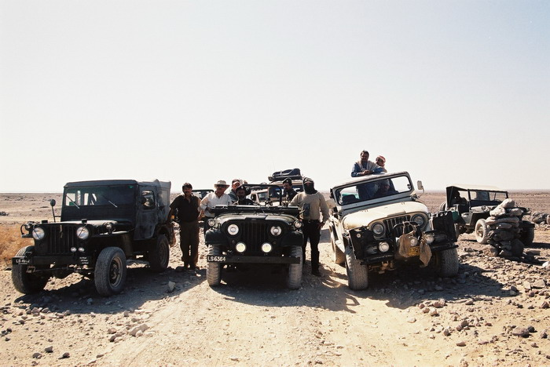

The left jeep is Dr. Rehman Baig's M38, built by Daud. The middle one is Salman's M170, and the CJ7 on the right belongs to Dr. Mansur. All three of these jeeps see a lot of action and manage to come through with flying colors despite the best efforts of their owners.

## Comments (1)

**ching** - October  7, 2004  2:48 PM

where's the big meaty tires???????

