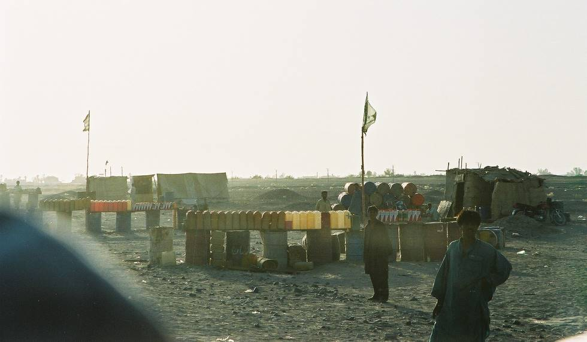

This is one of the bigger petrol stations near the Iran-Pakistan border. All the fuel is brought accross the border in the best interpretation of free trade. Free trade fuel is around 1/10 the cost of non free trade fuel, so it is very popular here.

## Comments (1)

**Imad** - July 30, 2003  1:40 AM

1/10 the cost and 100x as lousy. If you thought diesels were sluggish and slothlike, wait till you try this stuff. Makes Shell's and PSO's diesel feel like 110 octane racing fuel. Oh, by the way, have fun rebuilding your fuel pump :p.

