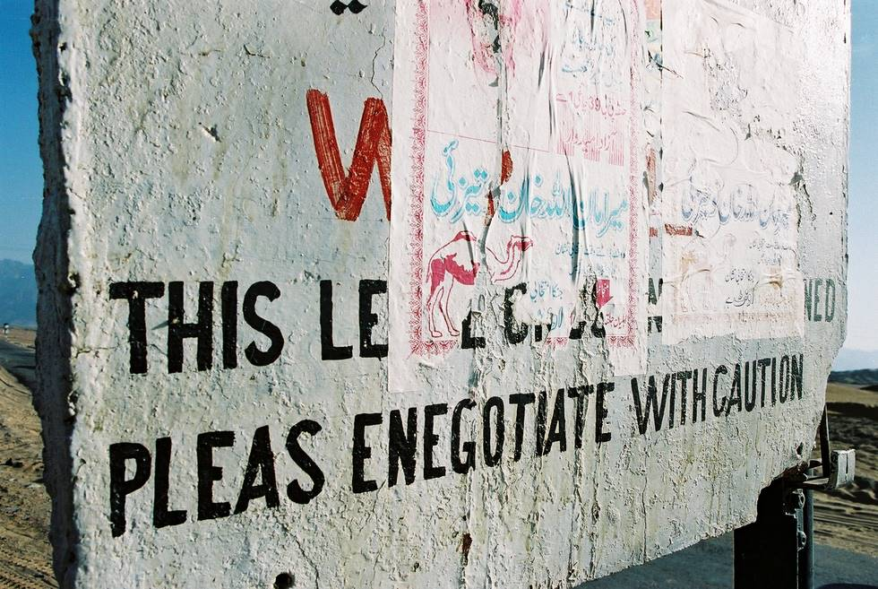

A typical sign in Baluchistan. The local government try their best to cover them up with politcal propaganda, but even they sometimes run out of posters and have to leave a few square inches here and there.

## Comments (1)

**Salman** - July 20, 2003  1:39 AM

Its not the govt that covers up the signs with propaganda, its politicians aspiring to make it to the assembly that plaster these posters.

