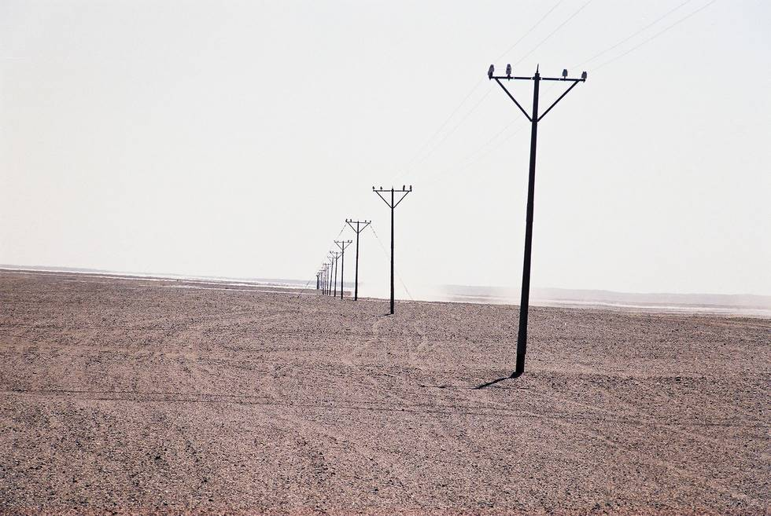

Poles stretching off to the Horizon.

## Comments (1)

**Yaseen** - October 26, 2003  8:20 PM

The zigzagging ruts along these poles are the only route to follow through this desert. Losing sight of the poles can prove fatal, as it did for a couple of boys from Karachi when they tried to look for a smoother path.

---

