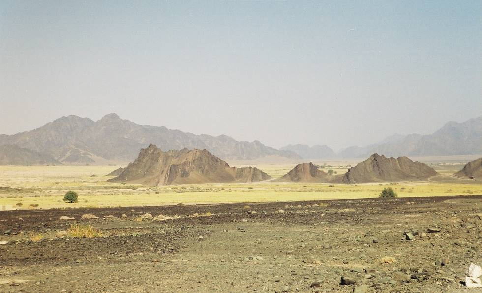

Ras Koh Mountains: If you look at the road going West from Quetta to Nushki, Dalbandin and on to Iran,this picture was taken just South of "Yadgar Chauki" where the road takes an "s" bend, the range is not Chaghai Hills but the "Ras Koh" Mountains, so the cameramans back is towards North and picture taken facing South, and quite rightly the Salt Marsh (Hamun-e-lora) is behind the photographer.

## Comments (6)

**Wayne Pfingsten** - January 15, 2005  6:15 AM

...is [this the location](http://www.expedia.com/pub/agent.dll?qscr=mrdt&ID=3XNsF.&CenP=29.300316,64.699875&Lang=WLD0409&Alti=200&Size=656,532&Offs=0,0&MapS=0&Pins=|6e835c|) the photo was taken from? What direction were you facing when the shot was taken? I am assuming west, and then there would be a (dry) salt marsh to your back?

...or perhaps [this was the location](http://www.expedia.com/pub/agent.dll?qscr=mrdt&ID=3XNsF.&CenP=29.210964,65.710231&Lang=WLD0409&Alti=500&Size=656,532&Offs=0,0&MapS=0&Pins=|6e835d|) instead?

---

**Taimur Mirza** - January 15, 2005  4:30 PM

Please refer to Map of Pakistan by: Nelles Verlag, Schliessheimer Str. 371b, D-80935 Munchen, Federal Republic of Germany. If you look at the road going West from Quetta to Nushki, Dalbandin and on to Iran, this picture was taken just South of "Yadgar Chauki" where the road takes an "s" bend, the range is not Chaghai Hills but the "Ras Koh" Mountains, so the cameramans back is towards North and picture taken facing South, and quite rightly the Salt Marsh (Hamun-e-lora) is behind the photographer. The second picture on the rail track was taken at 'Karodak' where the road is crossed by the rail track, the picture was taken looking towards Quetta. I hope Khalid Omar will make the necessary correction in the titile of the picture accordingly.

---

**Wayne Pfingsten** - January 18, 2005 12:38 PM

Thank you very much, and especially for the quick reply. I am able now to locate it precisely now on the map grid at the 2nd referenced URL. It appears the camera is looking at a small village called Kambran, or perhaps between there and Garruk. It looks like you were about 50km east of Dalbandin then. The salt marsh I did not have a name for, so that also is a helpful reference. I am curious about the condition of these salt marshes. Are they hard and dry all year, or do they have standing water of some (???) depth during the winter and spring rains? (assuming other than drought conditions) It is amazing to me we can have this conversation when we are on opposite sides of the world. The web is truely wonderful.

Thank you again.

---

**Wayne Pfingsten** - January 18, 2005 12:59 PM

[This Expedia map](http://www.expedia.com/pub/agent.dll?qscr=mrdt&ID=3XNsF.&CenP=30.208947,67.017509&Lang=WLD0409&Alti=200&Size=656,532&Offs=-516.639567,-287.543860&Pins=|69e5|) ( I am saving costs where I can, and everyone should be able to access Expedia ) shows all of the llocations you have cited. As you may know, the distance between each of the one minute paralell lines of lattitude is exactly 60nm, or about 75 statute miles. This map shows half minute lines as well, which are half the minute distances. The vertical lines of longitude will of course be quite distant at the equator and converge on the poles so they are NOT a reliable indicator of distance. With a drawing compass one can easily discern distances using the horizontal gridlines, which are always paralell and therefore utterly reliable. Also, if one has access to GPS one can navigate quite well using the grids. I hope, in return for your favor, you will find these hints helpful.

---

**Khurram Farooq** - September 28, 2005  2:41 PM

I was wondering if there are any GPS software available which have detailed maps for Karachi. Does anyone know?

---

**hydrocodone 5 500** - March  4, 2007  1:33 PM

Cool site. Thank you:-)
<http://s-url.net/02yj/> hydrocodone online

---

