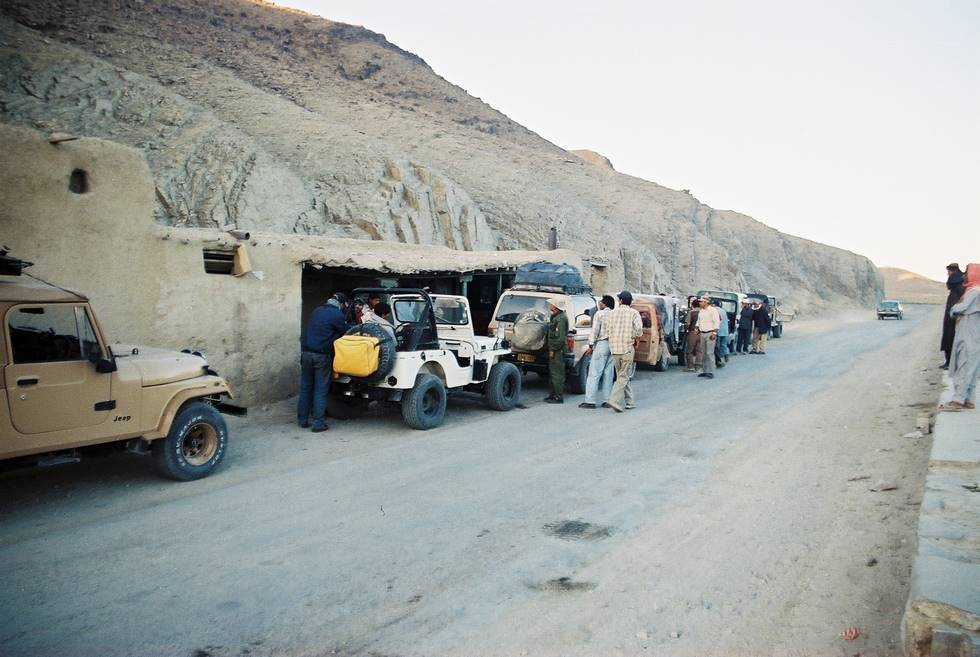

Stopped on the road just before Quetta. It was very cold here in the evening, close to zero degrees Celsius.

## Comments (1)

**Kahn** - August 31, 2007 12:29 PM

Now I know how this road look like during the day. I drove to Quetta on the way to Iran at night fall and could only make out the silhouttes of mountains and buildings. Many pictures here remind me of my wonderfull venture through Pakistan. Many people warned against driving after 1800hrs but I had no choice. Anyway, I was safe.

