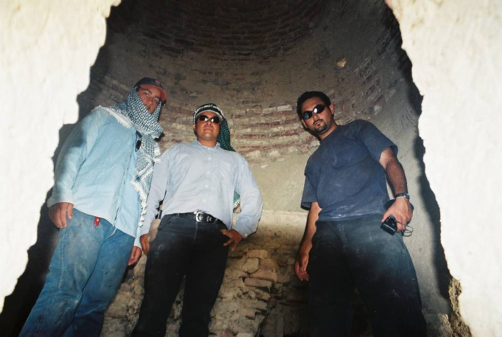

Standing in a tomb. Its very old, and mummies were excavated by foreign archaeologists in the 70's.

## Comments (2)

**Imad** - July 18, 2003 10:07 PM

The Return Of The Mummies??

**Kahn** - August 31, 2007 10:03 AM

What happened to the mummies? Were they taken away by foreign archeologist or just borrowed? Pakistan has so much treasure of the past but this has not been collected and churned into cash as exihibits. In developed countries treasures of the past esp from Asian, African and Latin American countries are housed in huge museums where locals and tourists pay billion $ to see. Some information would help. The Karachi 4x4 Club has done some excellent job and inserted unselfishly some interesing photos of their ventures.

