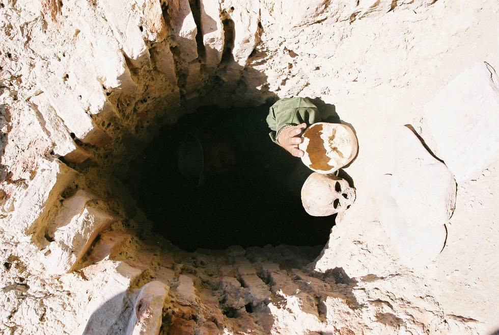

Skulls emerging from within.

## Comments (6)

**M_Adeel_Qureshi** - August 25, 2005  9:30 AM

i, M Adeel Qureshi is the Student of Archaeology and doing my M. Phill in Archetecture with special reference to chokhandi tombs in Pakistan, i like your web site
M Adeel Qureshi,
Research Assistant,
Pakistan Study Centre,
University of Karachi

---

**Kahn** - August 31, 2007  9:41 AM

Very interesting; it will arouse more interest if some information follows archeological finds or work.

---

**M-Adeel Qureshi** - October  1, 2007 11:27 AM

Dear Students! and all, I wish to recieve comments from different sections,,about the development of Archaeology in Pakistan, Kindly send ur commnets on
oyestermkb@yahoo.com
M Adeel Qureshi,
Research Assistant,
Pakistan Study Centre,
University of Karachi
0322-2539606

---

**M.Adeel Qureshi** - October  1, 2007 11:43 AM

Karachi Univesity Lecturer available to teach at your Home/Institute, private University, the courses of History, Geography, Pakistan Studies, International Relations,

M.Adeel Qureshi,
Research Assistant,
Pakistan Study Centre,
Lecturer, Arts Faculty
University of Karachi
0322-2539606

---

**M.Adeel Qureshi** - October 22, 2007  3:27 PM

Sind:
Sindh (Sindhī: سنڌ, Urdū: سندھ) is one of the four provinces of Pakistan and historically is home to the Sindhis. Different cultural and ethnic groups also reside in Sindh including Urdu speaking people who migrated from India at the time of independence and partition as well as the people migrated from other provinces after independence. Neighbouring regions are Balochistan to the west and north, Punjab in the north, Rajasthan and Gujarat (India) to the east, and the Arabian Sea to the south. The main languages are Sindhi and Urdu. In Sanskrit, the province was dubbed Sindhu meaning "ocean". The Assyrians (as early as the seventh century BCE) knew the region as Sinda, the Persians Abisind, the Greeks Sinthus, the Romans Sindus, the Chinese Sintow, while the Arabs dubbed it Sind. It is mentioned to be a part of Abhirrdesh (Abhira Kingdom) in Srimad Bhagavatam [2]. Sindh was the first place where Islam spread in South Asia. As a result, it is often referred to as "Bab-al-Islam" (Gate of Islam).

---

**AdeeL** - October  9, 2008  9:49 AM

Kuch aur sochne ki zarorat nahi mujhe,
Tere siwa kisi se mohabbat nahi mujhe,

Rehta hai bas tera hi mujhe raat din khayal,
Main tujh ko bhol jaon yeh taqat nahi mujhe,

Kal shab tumhari yaad mein aanso chilak pade,
Ab kuch bhi kehne ki hajat nahi mujhe,

Kis ko sunaon gi ke mein apna yeh hal-e-ahewal,
Tum ne to keh diya hai ke fursat nahi mujhe,

Khushiyon se ab nahi hai koi rabta mera,
Pal bhar tumhare ghum se faragat nahi mujhe,

Sab kuch ujar gaya mera khuwabon ke sath sath,
Faraz magar kisi se shikayat nahi mujhe...

0323-2988014

---

