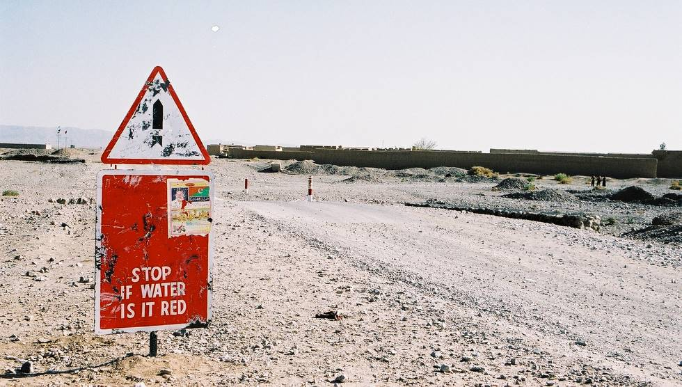

Everyone was stumped by this sign. After much thought we came up with 3-4 different theories as to what it really means, but to this day no one is sure.

## Comments (9)

**Imad** - October 27, 2003 10:38 AM

It probably means, "Stop if water is at red."

**patricia** - January  2, 2004  8:30 PM

I'm still stumped, Imad

**imad** - January  3, 2004  8:39 AM

Flood waters probably run over this area and the sign is there to indicate that the water is too deep to be safely crossed.

**ImranNY** - December 19, 2004 10:15 AM

I think common sense should prevail-
Who ever made this sign, and his superiors, got third class in metric!

**Nasir Ali Khan** - May 23, 2005 12:48 PM

the red and white poles indicate the level of the water in the Wadi. In case of a flash flood, one is cautioned not to cross if the water level at those poles touches the red mark.

**Stephanie** - July  4, 2005 10:00 PM

Can it have anything to do with a bomb? See the little bomb in the top sign? NAd in other pictures there was mention of 5 nuclear weapons tested. Maybe it's some kind of runoff.

**Muhammad Mansoor** - October 23, 2005  5:37 PM

Salam, this sign board means STOP IF THE WATER IS RED(NEXT). In these areas of Balochistan, the hill torrents are too powerfull the drag a fully loaded Nissan/Hino Truck with 10 Wheels, and water is red means water flow is just getting stronger, so if you put your vehiacle, this will go many kilometers with the water... Same thing happens near Dera Ghazi Khan, where I seen this many times happening...
Mansoor
Finland

**Kahn** - August 31, 2007  1:01 PM

Most Asian countries have road signs that baffle many foreigners but for locals not to recognise them, then something has gone wrong. It might not have anything to do with flooding as there are settlements nearby that could also be flooded. Maybe the nearby residents can unwrap this mysterious sign. What about the local councils, police or other road users? It would be interesting to know the answer and then be aware of how people thought years ago.

**Adeel** - December 15, 2008 11:36 AM

Nasir Ali's comment is the correct answer
"the red and white poles indicate the level of the water in the Wadi. In case of a flash flood, one is cautioned not to cross if the water level at those poles touches the red mark."

