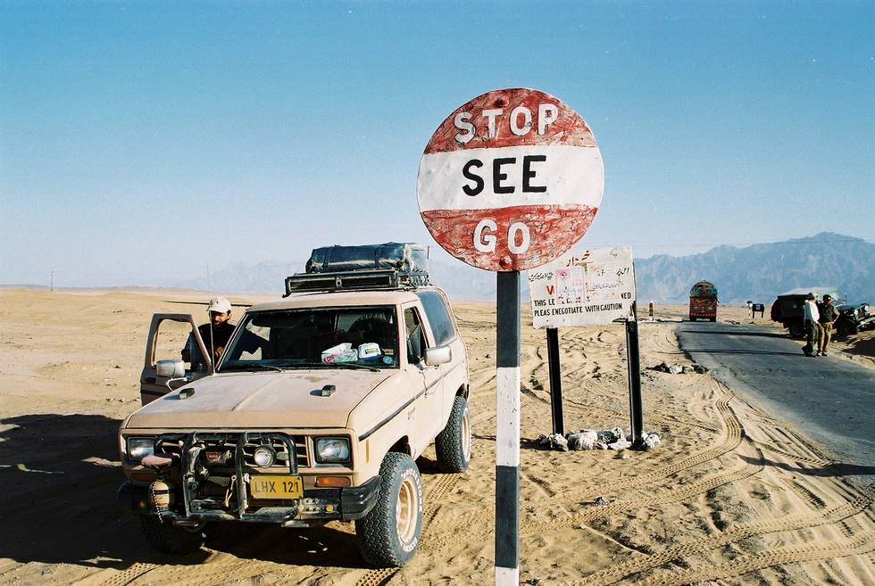

Abid is stopped and seeing. He is not yet go.

## Comments (1)

**Udayan** - February 22, 2006 11:34 AM

Man!
India is SO MUCH like Pakistan... from the road signs (like the one above) to the Dhabas, to the people on the roads, to the National Highways Authority sign boards, to the broken down trucks on the road, to the remnants of infrastructure set up by the British government being used by our armies....
Our countries should be associated with each other in many more ways... we are, after all, one people.
The world has to stop looking at India and Pakistan as rivals.
Maybe a Union of Subcontinental Countries (Pakistan, Bangladesh, Nepal, and India), like the European union?

---

