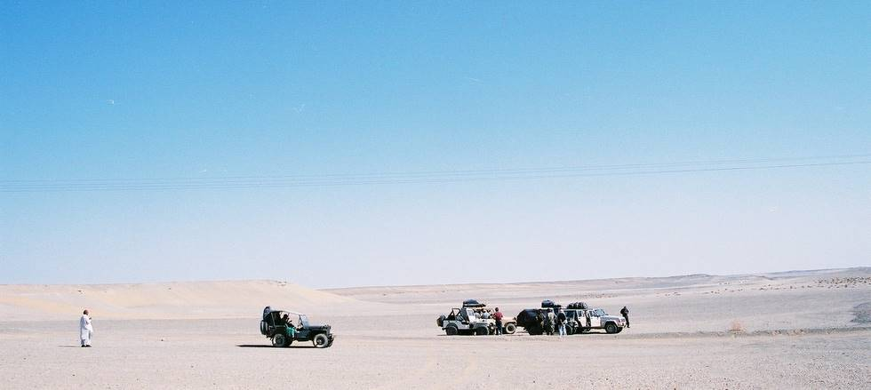

A pit stop along the way to make sure we're headed in the right direction. No one had a compass, but we did have one GPS which no one really knows how to operate.

## Comments (1)

**Muhammad Mansoor** - October 23, 2005  5:09 PM

Salam, I really like this nice comment that we have a GPS but no one really knows how to operate. Can you do me a favour? If you can post your 4X4 capability of HMMVV, the jeep most used by USARMY. I am planning to buy one, also tell me please about how to join your club? I live in Finland, but planning to join you casually your trips to Balochistan and Northern Areas...
Allah Hafiz
Mansoor
Ps: Reply me on email please...

