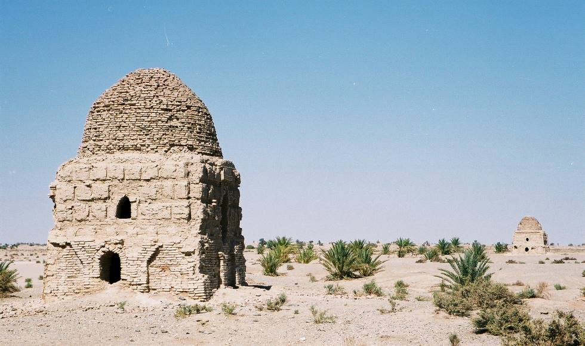

The tombs at Galuga are unique as these are 'double storyed' the upper chamber contains one single grave, probably of the man of the house and the lower chamber contained several bodies of women and children, laid to rest side by side over a period of time, related to the man. Such tombs are rare, normally there is one single grave in a tomb like at the necropolis at Makli, Thatta in lower Sindh.

## Comments (1)

**SalmanZ** - February 26, 2010  9:11 PM

Double Story tombs: Sounds interesting and unique!

---

