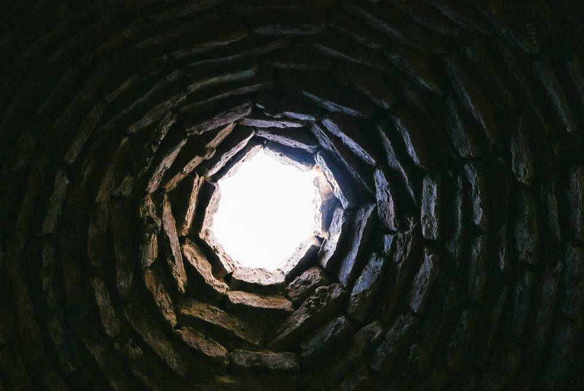

The view from inside the tomb.

## Comments (2)

**Woody wood pecker** - July  5, 2003 10:30 AM

HOLE...... SWEET HOLE.

**bergzwerg** - October  7, 2006 11:04 AM

Weird: "... and I was in a tunnel with a bright white light ... turning red ..." (Or vice versa ?)

Looks exactly like what nearly-dead people say they experienced.
Does the light here turn orange/ red at sunrise and sundown ?

