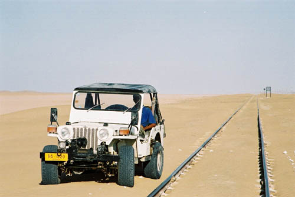

This area looks like something out of Lawrence of Arabia. We might have been on 4x4's, but the locals still use camels. The picture on the rail track was taken at 'Karodak' where the road is crossed by the rail track, the picture was taken looking towards Quetta.

## Comments (1)

**Wayne Pfingsten** - January 15, 2005  6:04 AM

Where was this picture taken? I am thinking along the rail line extending from Quetta, past Dalbandin airfield and onto Iran? If you could, please reference a place nearby that I can locate using Expedia's World Mapping service. It is quite frustrating to have all of these excellent pictures and no way to locate them on a map. I thank you for your help as I am writing a book about Pakistan and wish it to be as accurate as possilbe. These photos have been very helpful. Thank you very much.

<http://www.expedia.com/pub/agent.dll?qscr=mmfn>

..is the link to the Expedia site's MAPS tab....

---

