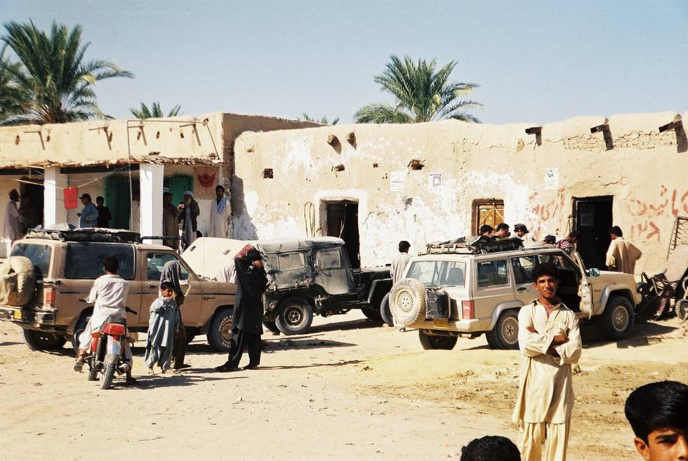

Early morning and we were hitting the workshops. This was the only one open.
The Cherokee and the M38 had busted shock absorbers, while the Bronco's radiator had fallen out.

## Comments (1)

**Taimur Mirza** - June 26, 2003 11:57 AM

The Town is Qila Ladghasht, Mashkel, close to the Iranian border.

---

