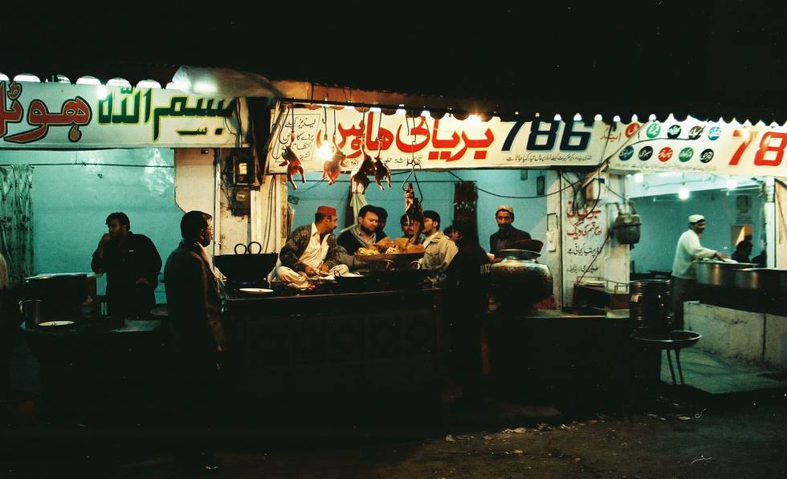

There is where we got the fried fish for dinner - trucked all the way from Karachi. I think the rarified air of Quetta is good for the fish - they taste better here.

## Comments (1)

**abdullah** - July 13, 2006  2:23 PM

i like quetta city for every time and this is my birth place and i like this too much
nowi am here afghanistan and i am working with UN office with american armi so i am happy and i have a good job
thanks
and i like thies shop and i have been eat many time here best food thanks

---

