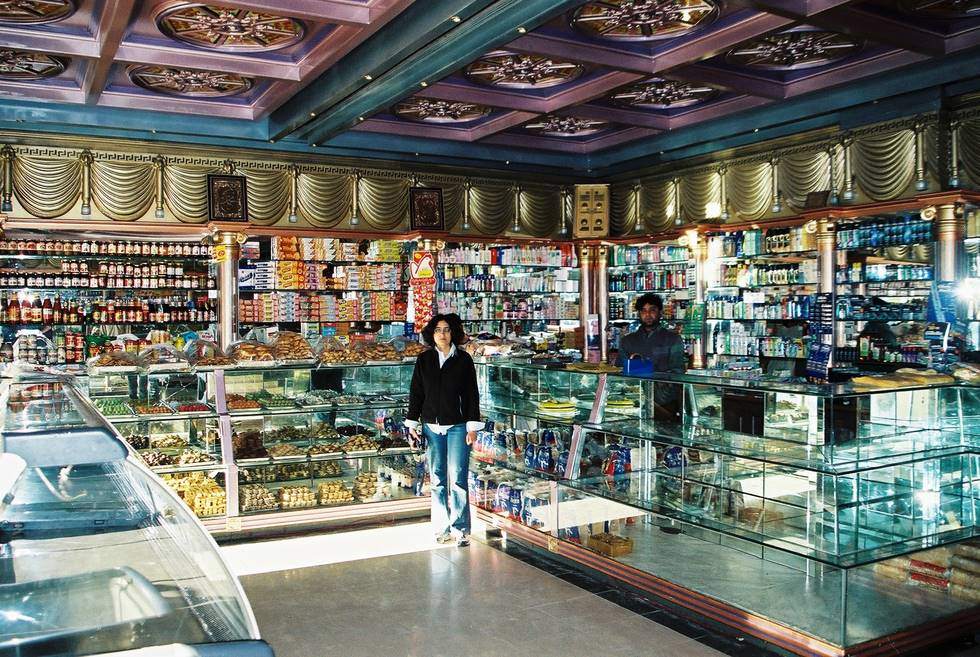

MO standing at the counter of the Dolphin Bakery. This is the place to shop for food items in Quetta. Just about everything is here, and it's always been spotlessly clean. (the last 8 years at least since we've been going there).

## Comments (6)

**Aamir** - December  9, 2005  1:38 AM

well dolphin bakery was opened somewehre in 2001-02.. how came u going for 8 years

**KO** - December  9, 2005 11:01 PM

That's a good question. I'm pretty sure it was there in 2000 though.

**imran** - December 12, 2005  3:23 PM

this is more of question: when is the best time to visit quetta especially if you want to experience the snowfall.

**KO** - January  5, 2006  3:16 AM

End December to January is the best time for snowfall.

**imad** - January 17, 2006 10:42 AM

A bit late to the party but I am pretty sure we did a lot of our food stuff shopping at the Dolphin Bakery in 2000 enroute to Khunjerab.

**Manan Khan** - December  5, 2010  5:26 PM

wah what a cakes for dolphin

