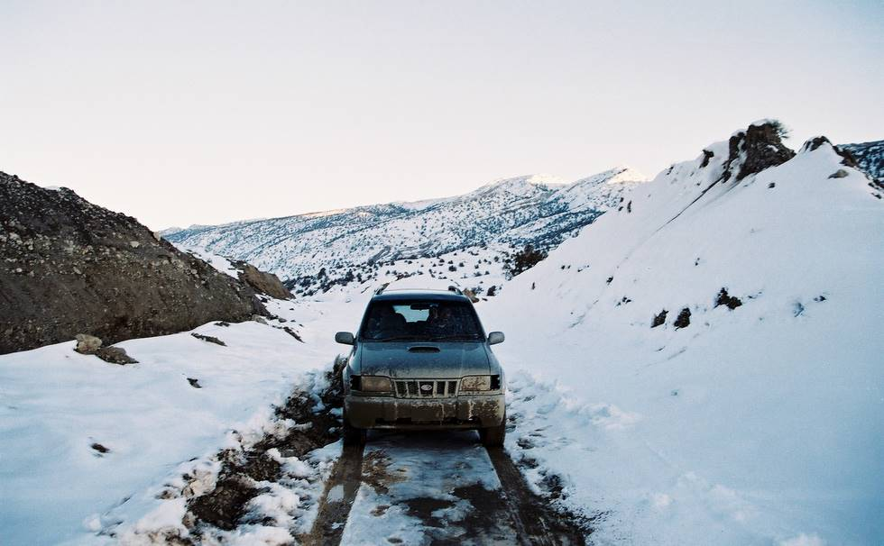

Another picture of the road. This was the heaviest snowfall in Ziarat after many years.

## Comments (11)

**KO** - July 13, 2004  9:56 PM

This is a test

---

**KO** - July 13, 2004 10:00 PM

this is a test

---

**Janice Soares** - September 29, 2004 10:25 PM

All your photographs brought back many pleasant memories. I used to attend St. Joseph's Convent High School in Quetta which was on Lytton Road across from the boys school St. Frances Grammar. I was a boarder there.

---

**sharon bulita** - October 11, 2004  3:42 AM

i lived in pakistan for the first ten years of my life. my family and i used to live in quetta, and traveled through bolan pass, sibi desert to karachi for our holidays and dental treatment! we also had holidays in ziarat. day trips to hannah lake, urak valley. oh to visit again now i am an adult. what happy memories i have and would so love to return to what i consider partly my home.

---

**Rebecca Sultana** - January 12, 2006 12:29 AM

Hi, I went to St. Joseph's Convent from 1971 to 72. I was in Class three and four. I would like to hear from anyone who went to the same grades the same time. I remember names like Shama Nasir, Afsana Kazin, Zehnab Mari. The Class four teacher was Ms. Gloria, if I remeber correctly.

---

**Kiren Choudhry** - April  4, 2006  1:21 PM

Hi, I went to St. Joseph's Convent in Quetta as well. I was there from 1991 till 1994; from Class three till six. I am looking for my friend Maimoona Kasi. The name of our teacher in class 6 was Ms. Andaleeb.

---

**aziz shah** - April 22, 2006  6:15 AM

its one of the cities that i would always like to be in, there is a taste that will never go and this city is is my hear.

---

**Uzma Sheikh** - February 20, 2009  3:43 AM

I went to St. Joseph's Convent School & Boarding (Quetta) between 1984-1987. Satrted from 1st standard. I only remember Ms. Pushpa Das and Ms. Laila Zubairi (Who has a daughter Tania) as they were teaching the junior school. Our house parent was Ms. Usha (salman's mom) & Sister Michel/Micael @ boarding. Then there was the daughter of our kitchen incharge Catherine, who was an attractive college going girl and used to live in the boarding with her mom as well. Then we had all jamali's & bazenjo's.... if someone can recall....???

---

**Faryal Bugti** - October 15, 2009  6:51 AM

I went to SJC from Nursery til Junior Cambridge, 1976-1985. I am looking for my former classmates, Sadia Azmat, Yasmeen Syed, Fareeda Jan & many more, look forward to touching base in this phase of our lives :)

---

**SalmanZ** - November 30, 2009  4:50 PM

Interesting comments...its school friend finder picture. Best of luck everyone... :)

---

**Anbreen Atiq** - September 29, 2011  7:27 PM

Hi, i went to Islamia Girls High School, Quetta. I did my matriculation in 1992. I want my class fellows to contact with me.

---

