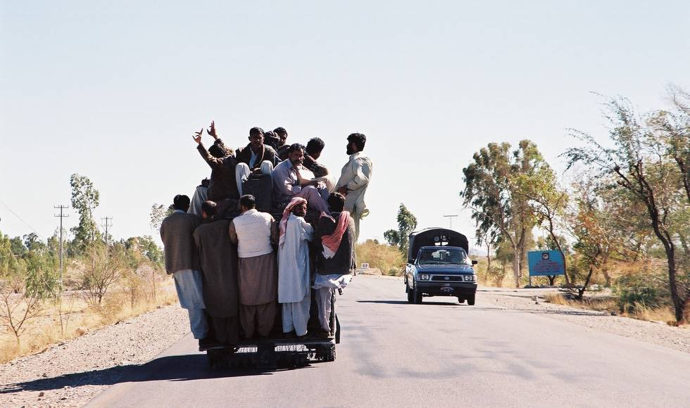

There are more people in this pickup truck than a typical New York subway train. Mind you, this is on the main highway to Quetta.

## Comments (4)

**khalil jibran** - October  1, 2004 12:08 AM

Masha Allah se bahut achha photo hai....
thoda dar zaroor hai ....
par isey dekh kar mughe apne gaon ki yaad ha gayi....

bahut acchha laga ki insaan insaan hi hota hai...
bahut khushi ho rahi hai isse dekh kar......
apne muslim bhai hai sab ...

well done
Khuda Hafiz

myself...
khalil jibran
software engineer
lucknow
india

---

**mr b.t.butt** - May  9, 2005  6:00 PM

i was overjoyed on seeing this beutiful scene .exactly still in my village same things happens daily, due shortage of transport. at least none is left behind to wait for for another one . thats if there is one

---

**imtyaaz mohammed** - March  7, 2006  9:12 PM

Mr Khalil jibran im also a musalman.but first im an indian,its my mother nation.tujhe woh musalman bhai lagega,but if thosa hangers are not musalmans what are they for u?so be a man first,then a believer.the holy quran teaches that and i think ur not ready to accept that.

apne sabhi pakisatani bhaiyon..... u can improve ur situation.come out from taboos and work to develop the nation.then ofcourse this wont be the picture taken after 10 yrs.

khuda hafiz

from

brothers from india(which include all muslim,hindu,christian,jain,parsi,buddhist,sikh)

imtyaaz mohammed
senior project analyst
IBM corp
mumbai

---

**S K Durrani** - August 25, 2009 10:29 PM

I think this is Khuzdar.

---

