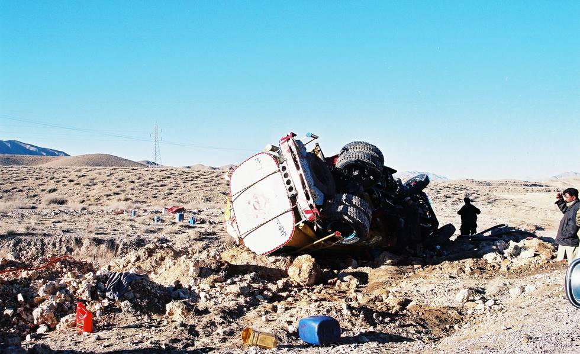

Another overturned tanker... once again the culprit was a broken tie-rod end. Of course, the tie-rod end also broke due to excess stress placed on it by the driver suddenly realizing the upcoming bend which looked just like the previous 100 bends was a lot sharper. I think this is why in the west they have all those road signs warning off exactly such things.

## Comments (3)

**faiz** - June 16, 2005 12:45 AM

TERE ANDAZ MUSTANA . HAY NA MUSSARAT SHAEEN ISTAYLE

**RadarBlip** - August  6, 2005  2:09 PM

What do you say, would the driver have survived?

**KO** - August  6, 2005  7:12 PM

I spoke to the driver, him and his helper were very much alive and unharmed. There was a sudden unmarked curve, so the driver must have noticed it too late and when he tried to turn too late the tire rod snapped.

