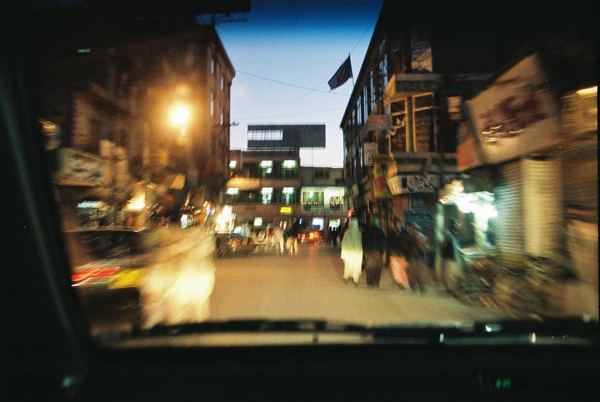

Liaquat Bazaar at night.

## Comments (2)

**Asif Punjwani** - October 24, 2005  9:09 PM

Lord! I stood on these streets in the winter of 1997. Cant believe how time flies. Would you know Sen. Saeed Hashmi from Quetta?

**sharif khan** - October 24, 2006  4:14 AM

i know this place becoz i have seen that place alot and i have some memorible time there with my friends and some time with my family . i m sharif khan batozai from loralai and i worke there in quetta in an NGO that works for the creating new facilities and ways for the provision of water in remote areas

