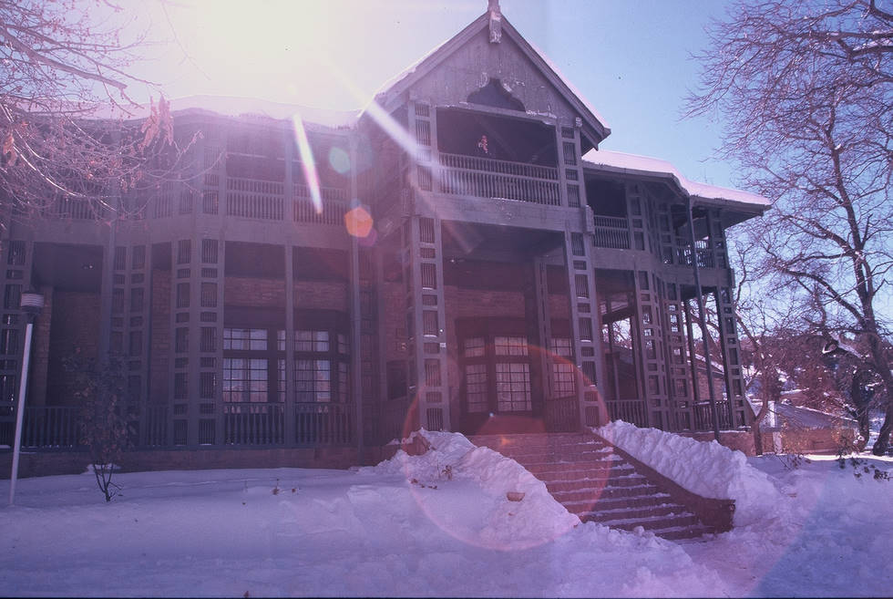

A picture of the Quaid-e-Azam residency. It's beautiful. Back when it was built, it must have been really amazing.

## Comments (16)

**Mansoor** - December 14, 2004  7:03 PM

i love pakistan & i love quaid-e-azam. every thing belonging to him is holy for me. but its my request from govt. that plz protect the things belonging to quaid-e-azam.

---

**saba** - March 16, 2005 10:07 PM

i love QUAID-E-AZAM n everything belongs 2 him. he is my favourite personality i want to be like him but i can't.its my request 2 govt plz take care of everything which belongs 2 QUAID-E-azam.cause i luv himmmmm.

---

**Shoaib Khan** - March 25, 2005  1:39 AM

We all love him for every thing he has done for us ( Pakistani's), God Bless him for what he has done for the muslims.
I love and appreciate him as a true leader and i wish todays leaders would have been like him too. GOD BLESS HIM.
I Request the Govt to please take care of his belongings.

---

**zulqarnain** - June  6, 2005 11:50 PM

i love pakistan & our the greatest national hero QUIAD-E-AZAM. govt should take care of his belongings.

---

**Talha Ejaz** - August 31, 2005  1:54 AM

This site rocks! simply amazing

---

**Samar Ellahi** - January  4, 2006  3:57 PM

if anyone ask me: What is more important to you, Pakistan or your life? I will say: my life? You will walk away from me without knowing that Pakistan is MY LIFE!!!

---

**Adeel Royage** - March 13, 2007 11:09 AM

A great personality, a great leader especialy for the people in Pakistan. If we see internationaly it was Allama Iqbal who think for the whole Muslim of the world. But Quiad-e-Azam think only for the Muslims living in Indopak. That's why Quiad-e-Azam is most important personality for people living in Pakistan. I love Quiad-e-Azam and to be try to some well for my country as well.

---

**WAQAS SIDDIQUI** - September 15, 2007  6:52 PM

LOVE PAKISTAN TO BUILD PAKISTAN.

---

**Arslan Rafi** - September  3, 2008  7:05 PM

Accorsing to Quid-e-Azam we are the [students] feature of PAKISTAN.So,its our douty to serve the PAKISTAN.Quaid-e-Azam was one of the greatest person in tjis world ho strigle hard for his people [MUSLIMS].
SO,we love to our Quaid who is most respectable for us.
we are all Pakistani have the spirt to do some good deeds and ideas for the battermaent of PAKISTAN.
[I LOVE YOU MY QUAID.]

---

**ALI ABDUR REHMAN** - September  4, 2008  9:59 AM

BISMILLAH
ASSALAM O ALAIKUM
QUAID E AZAM IS MY FAVOURITE LEADER .HE had kind nature for muslims of subcontinent .He was always well dressed and true genttle men

---

**Sam Quraishi** - September  8, 2008 11:44 PM

Salam,
This is Sam from Soni Motors Thailand (www.sonimotorsthailand.com). Looks amazing.

I have an offsubject question. Is any of your member using Toyota Hilux Vigo. As you probably know we are Thailand's top Toyota Hilux Vigo exporter to Pakistan and very interested in profiling how some of our customers are using their Vigo for 4x4 adventuring

---

**saadia sattar** - December 15, 2008  6:50 PM

only a few nations have good leaders,who have woked with full devotion.so i request u all to pay full respect to him because he deserves it.i have heard some people using loose language for him.i request all such people to think before using such words for him.all such people should mind it that if we r breathing freely on this piece of land,it is all because of efforts and work fo this country.he is really a great leader.we all r united under the identity of being pakistani.

---

**zara** - November  6, 2009  4:22 PM

he is really a great leader n we all love pakistan n every thing belongs to him he is my favourite personality

---

**tayyaba** - October 24, 2011 11:39 AM

i love my QUAID and every thing belonging to him is holy for me.i request the whole nation especially to youngsters please adopt our own culture and traditions and promote only urdu language please please...

---

**SHEEREN** - January 29, 2012 11:48 AM

HE IS THE GREAT PERSONALITY. WITH HIM THERE WAS NO PAKISTAN THERE WAS ONLY AN INDIA.N HE IS MIN E FAMOUS PERSONALITY TOO.I APPRECIATE HIM FOR HIS DEEP DEVOTION AND GREAT SACRIFICE FOR THE COUNTRY PAKISTAN.HE WAS AGREAT MAN. I WANT GOVERNMENT TO TAKE CARE OF HIS BELONGINGS TOOOOOOOOOO!!!!!!!!

---

**SHEEREN** - January 29, 2012 11:50 AM

HE IS THE GREAT PERSONALITY. WITH HIM THERE WAS NO PAKISTAN THERE WAS ONLY AN INDIA.N HE IS MIN E FAMOUS PERSONALITY TOO.I APPRECIATE HIM FOR HIS DEEP DEVOTION AND GREAT SACRIFICE FOR THE COUNTRY PAKISTAN.HE WAS AGREAT MAN. I WANT GOVERNMENT TO TAKE CARE OF HIS BELONGINGS TOOOOOOOOOO!!!!!!!!

---

