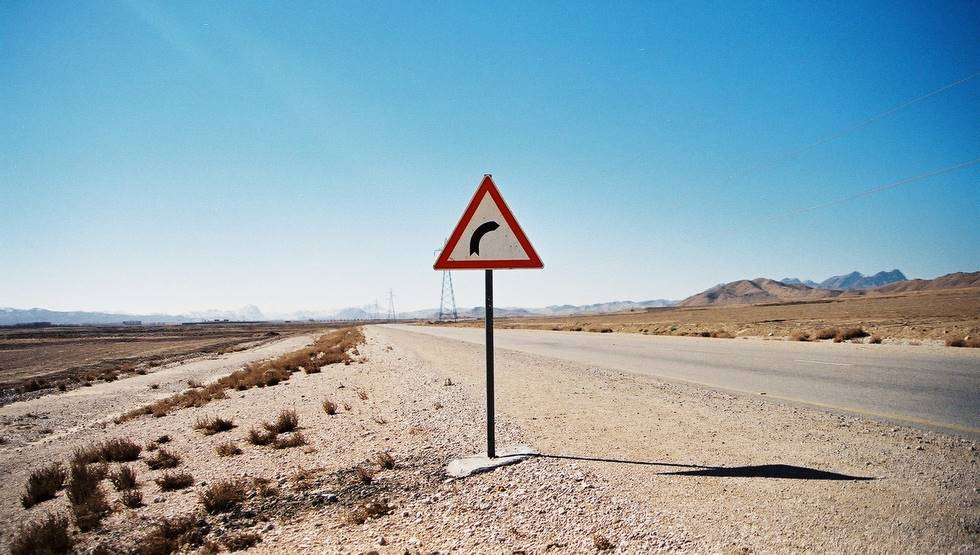

A picture of the highway. I've been told it violates the photographic law of two-thirds or some such thing, but here it is.

## Comments (6)

**MO** - July 27, 2004 10:25 PM

yes. the sign ought to have been a bit more to the center of frame. so we can see it better.

---

**Ahsan Ali** - July 28, 2004 11:06 PM

Center of frame? See it "better"? It IS pretty much in the center!

MO, you got some serious astigmatism going on there!

Either that or you meant the road should have been in the center...

---

**MO** - July 29, 2004  8:05 PM

Ahson, unless you are utterly blind, this signboard is NOT exactly in the center of the frame. Perhaps you need to get your eyeballs more firmly embedded in the center of your head.

---

**Ahsan Ali** - July 30, 2004 12:06 AM

Hey Cyclops, to regular old one-eye-on-each-side-of-the-nose me, it looks pretty much in the center of the frame.

New glasses with cylindrical correction for you maybe? ;-)

---

**nadeem** - January 19, 2006  1:52 PM

:) the sign is that there is a right turn ahead, but the road is going streight !

---

**LaKeesha** - April 28, 2012 12:21 PM

aparadexto ine to katastima sas stin nea errehita ston paralio dromo tis ethnikis odou athinon lamias mas doulevete edo kai 24 meres gia 3 klimatistika iste pseftes kai lamogia iste aparadexti eksipiretisi miden alla prota apola tha prepi na mathete tous polites sas to pos na milame iste ena mpourdelo esxos apateones

---

