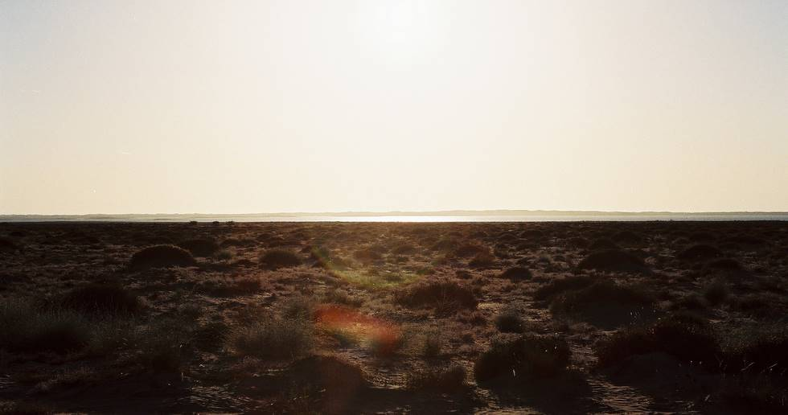

A view of Saroona lake from the highway. It stretches for many miles alongside the road, and starts about 10 kilometers after Winder. The bank is muddy, and in many places is quicksand. The lake is stagnant sandy water, so although it looks good the entire area around the lake is inhospitable and barren.

## Comments (1)

**Naveed Shehzad** - January  9, 2005  1:56 PM

Oh what a nice Pictures. it reminded my trip to quetta and ziarat in last winter. there is lot more beauty of Baluchistan which needs to be explore. Baluchistan has so many wonderful Places such as Bolan , Kan Miter zayee , Wadh , Jivani etc. our goverment should emphasise the tourism by giving more facilities to the toursit. But these Pictures are really stupendous it took me down the memory lane. i think everyone should visit Balcushitan in cow boy style ;). Hatts off to you guys

---

