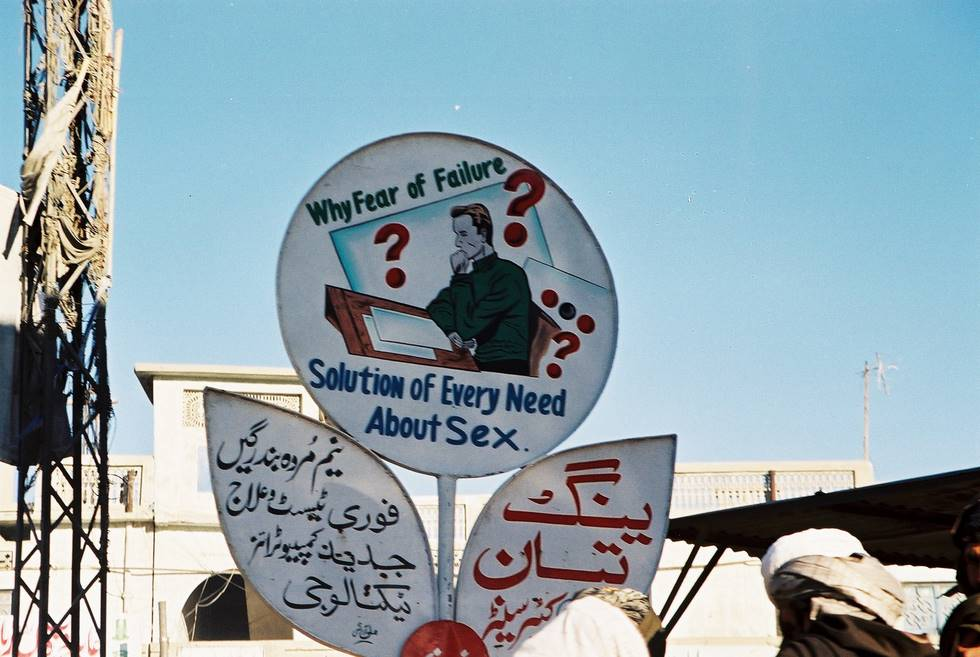

A typical billboard in Quetta... Pakistan is becoming quite liberal these days. Suprisingly enough there are lots of adds similar to this one all over Quetta.

## Comments (6)

**Nick** - May  9, 2004  8:09 PM

Could there be a knock off of Viagara available?

**Mullah Dopey** - May 12, 2004  2:00 PM

Aww Nick,

Now I wouldnt be asking for that publicly!!! :P

Mullah Dopyaza

**Salman** - May 12, 2004  2:06 PM

Such billboards are hardly the symbols of a liberal society, rather they depict a support industry to only the most prevalent and primitive form of entertainment known in the ultraconservative parts of Baluchistan and NWFP. (There is hardly any other form of entertainment there).

In Karachi or Lahore, instead of such ads, u will find TVs and stereo systems being advertised.

**Imad** - May 21, 2004  6:07 AM

Yeah, the Internet cafe`s in Quetta are a scary place to be. Honestly, you would rather not know why. Let's just say ther's a whole lot of entertainment going on in there. Make sure you scrub your hands with antibacterial soap after you leave :p.

**kalyan** - November 11, 2005  9:32 PM

HELLO FRIENDS!

I am from India and i never knew that Pakistan is so beautiful. I loved all the pics. Wish i was there in Quetta. I love Pakistan!

**shankar** - January 30, 2006  8:47 AM

pakistan is beautiful. I wish I can visit some day - Shankar from India.

