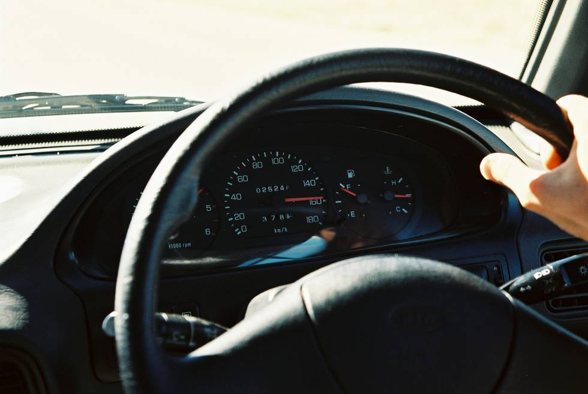

The roads were completely empty... so Abid decided to see how fast the Kia goes...

## Comments (11)

**Omair Babar** - May  6, 2004  8:32 PM

Damn, I didn't think these Kia's could go that fast!

---

**KO** - May  6, 2004 10:20 PM

It goes even faster actually.

---

**Hameed** - July 18, 2004  5:42 PM

Rev counter cannot be seen. But I am sure this is the last time ths perticullar jeep has touched 150

---

**KO** - July 18, 2004 10:19 PM

It actually hit 160 - and suprisingly enough, was just under the redline.

---

**Sohail Rizki** - November  7, 2004  8:01 PM

It can go fast there is no doubt, but if wheel comes off or it tire gets flat, the car or especially jeep can roll over many times.
So be careful.

---

**Abid Omar** - November  8, 2004  5:13 PM

Well, we got close to 170 km/h. And for an hour we averaged 120 km/h. Pretty fast for the KIA, though very taxing on the sound system - couldn't hear anything over the screaming engine. Now when I drive this car, its a challenge going above a 100 km/h, this engine seems to have had it. But we kinda convinced ourselves that its the sound of the so-called clutch fan.

And about wheels coming off, see this picture <http://offroadpakistan.com/pictures/chitral/major_breakdown.html> from an earlier trip from Karachi to Chitral in 1995. The axle pulled off the shaft while we were right behind. Fortunately there was a lull in traffic at that moment, and the driver, Taimur Mirza, expertly coasted the jeep to the side of the road (the right side).

---

**Amjad** - January 14, 2005 10:48 AM

Hello Abid,
Just wondering, did the engine wear out only by once running at 170 km/h or do you think it was a gradual wear out process. The odometer shows roughly 25K and I am seeking for your comment on Sportage's engine life and durability. Any update on engine's repairs, etc.
Thanks.

---

**KO** - January 14, 2005 11:05 AM

The odometer is now well over 40K, and the engine is still going strong. The noise Abid is talking about above was a slipping power steering fanbelt, which had to be replaced. The only work done to in the engine bay so far has been a few oil and filter changes. The engine seems quite durable - it has to be driven properly though. The short gearing combined with the low revs makes a lot of people not used to diesel engines ruin them very fast - but maintained and driven properly I think it will last well over a 100K. It is a mercedes engine after all.

---

**Amjad Chaudhry** - February  8, 2005 12:16 PM

Thanks KO for the reply.

---

**nauman** - June  1, 2005  4:56 PM

hey man BUCK UP ...!!!....but beware coz ...two guyz were killed trying to do da same attempt in Islamabad on HONDA CIVIC VTi at a speed of 200 km/h....thy were also trying to take da snapshot of the odometer but in VAIN....the driver died and da Co-driver was paralized for the rest of his life.

---

**hassaan** - June  1, 2006  4:58 PM

K.O what do you think about the stability of kia sportage.

---

