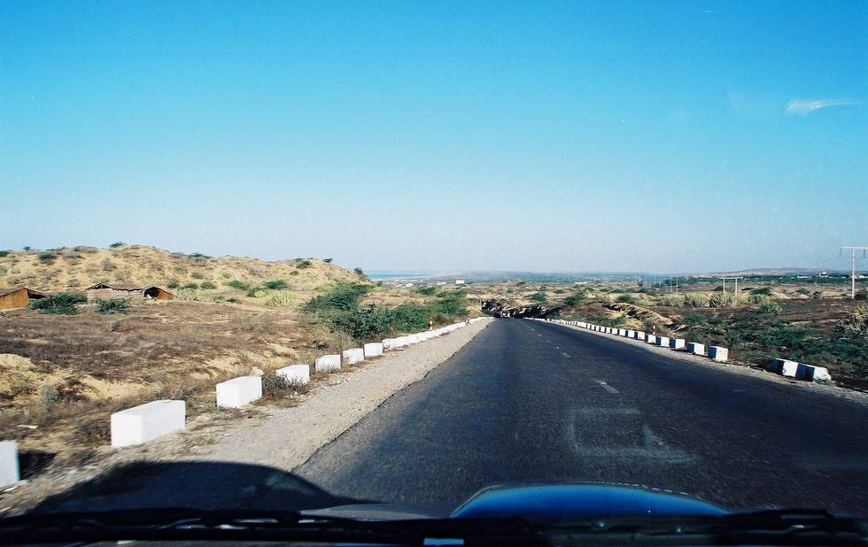

A view of the sea on the way to Hub. This is the only point on the highway where the sea is visible.

## Comments (3)

**rizwan** - March 29, 2005  1:26 PM

jannab aap nay to poora road deekha dia khair lakin aap nay picture bohat acchi li hai thanx

**Masood Ahmed** - July 26, 2005 10:12 PM

Picture is beautiful but it is disappointing to know that its the only part where sea is visible. What about Mekran Coastal Highway; is sea visible from many locations?

**Abid Omar** - July 28, 2005 11:00 PM

Yes, once you reach Aghor (Hingol River), you're driving right next to the sea. Beautiful views right along the highway, especially along the Buzi Pass.

