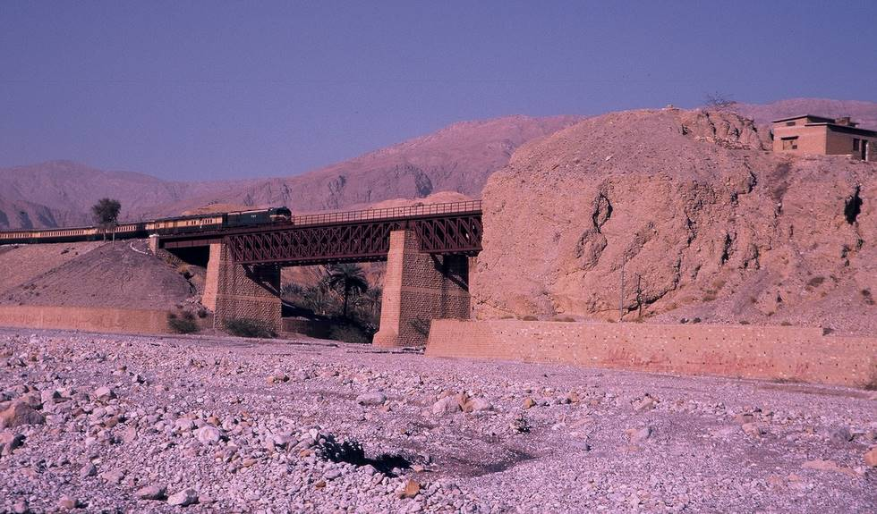

Train Crossing. This railway line was built by the British sometime b/w 1901-1908, and has been going strong since then. I doubt this bridge has undergone any maintainence work since partition.

## Comments (1)

**Khurram** - May 12, 2005  8:35 PM

I'm sure the intense dry weather of Balochistan has plenty to do with why the bridge hasn't required major repairs.

---

