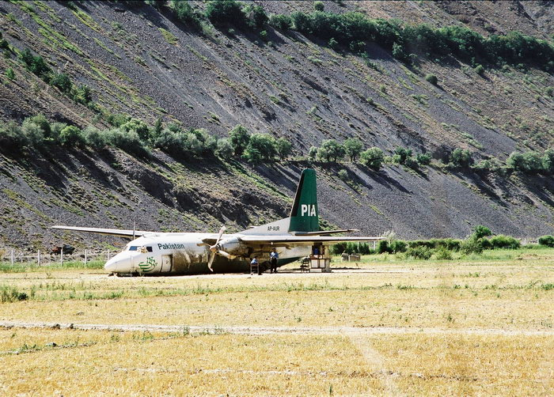

The plane landed too far up the runway. Notice the bent props - luckily no one got hurt. Pilots get only one chance to land at Chitral - they can't pull up for another go at landing once they are in the valley.

## Comments (2)

**Masd** - July 26, 2005 10:26 PM

Is it full of danger to fly to Chitral?

---

**Waqas Usman** - August  3, 2006 12:05 PM

Masd,
There are eleven weekly scheduled flights to and from Chitral (all are Peshawar-Chitral-Peshawar), and we don't see these emergency landings every day, so to summarize, I'd say no it's not life-threatening to fly to Chitral.

Now after the grounding of Fokkers, I don't know what the situation is nowadays, whether they use the new ATR-42 for any flights, or the C-130 for all flights or what.

Waqas

---

