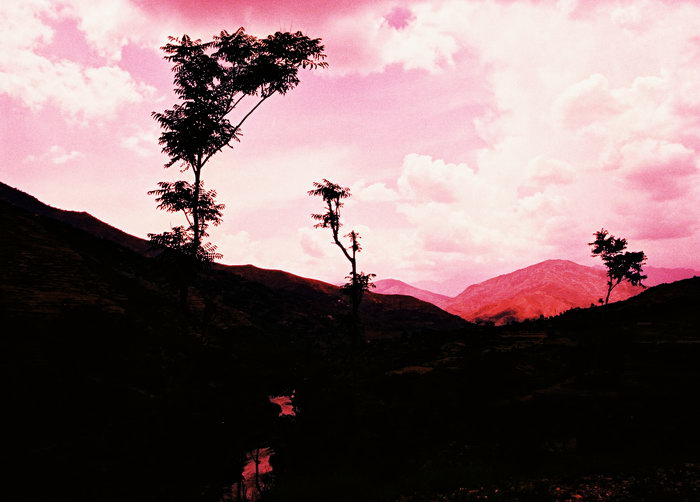

When you go fast enough, you experience something called akin to a doppler effect, where the light becomes red shifted. Picture by AO.

## Comments (2)

**mengal** - December 17, 2004 11:20 PM

AMAZINg shot just marvelous. Hey man or lady whoeve rya took this photo, tell me which camera do ya people recommend to take while going on such trip, I mean ya see I have never bene lucky to have a good camera even I have been changing my options but still.. Cheerz waiting for your reply

---

**Abid Omar** - December 18, 2004 11:07 AM

This picture was taken with a Canon EOS 55 using Fuji Velvia 100 silde film. The red sky and enhanced depth of field and detail is courtesy of cross-processing in C41 chemicals.

About recommending a camera, that depends on where you live. If you are in Pakistan, then don't get a Canon as no one here knows anything about them and you'll be hard pressed to find any accessorices for the camera. Nikon would probably be the way to go, but that depends on your budget. But all in all, Canons offer more value and are easier to use.

---

