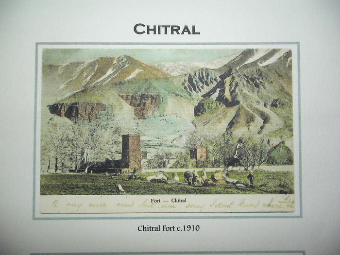

The orignal picture is at the HinduKush Heights hotel in Chitral.

## Comments (1)

**Rubina** - May 24, 2005  5:36 PM

wow its very nice to see such a lovely picture of chitral fort i never saw this picture in my life i showed this to my mom and she was very excited to see her house back in 1910 as she is princess Tahira zehra d/o HH Saif Ur Rehman Mehtar of Chitral. She highly appreciated the effort by your team you should also add a current view of the chitral fort on your web site so that people can see the changes which have occured during the past.
many thanks
rubina

---

