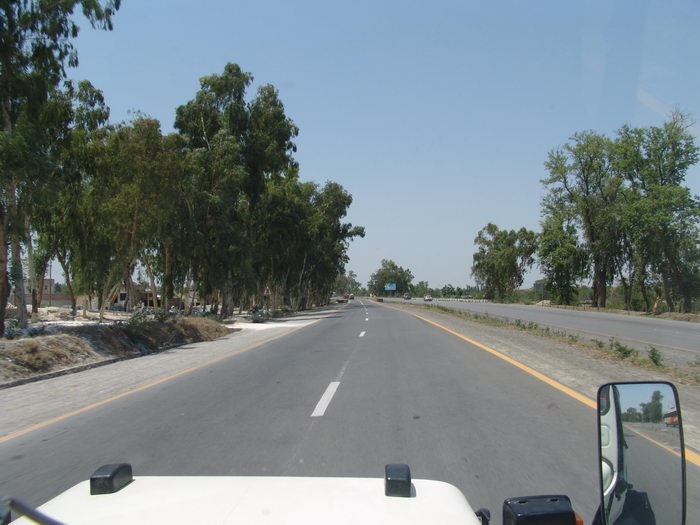

On the highway. The N5 (runs from Karachi to Lahore) has been improved a lot from what it used to be.

## Comments (4)

**Sohail Rizki** - November  7, 2004  8:09 PM

Is this how it looks like all the way to Lahore?

**KO** - November  8, 2004  4:47 PM

This is how one side of the road looks all the way to Lahore. The other side is the old highway, though that has been recarpeted to some extent also.

**umer** - March 28, 2005 12:34 AM

so there is a highway from karachi to lahore that stays four lanes (2 each way) the whole time?? or are there some parts that become smaller (down to 2 lanes)? and does anyone know what the speed limit is and how to get to this highway from karachi when you are living in gulshan-i-iqbal?

**Fawad shaikh** - July  5, 2005 12:30 PM

No!! there are some portions that are being constructed and (mostly in the province of Punjab) where road is pretty bad, (e.g. near Bahawalpur, sahiwaal, Okara etc.) road is also narrow (2 lane). However, from Karachi to Rahimyarkhan, 90% of the road remains 4 lane. If you are living in Gulshan all you have to do is to start your journey from the superhighway(starts from Sohrab Goth), the first city you will encounter (after 1 1/2 hr. drive) is Hyderabad, the signs on superhighway will automatilcally direct you to take the hyderabad bypass and will put you on N5.....

