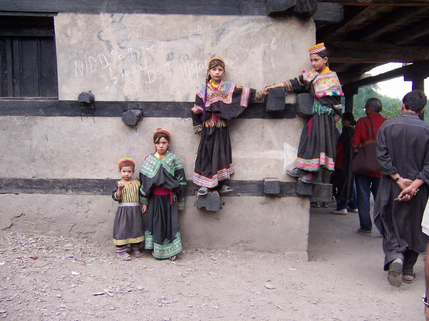

Kalash children.

## Comments (1)

**aasim** - February 18, 2005  8:33 AM

beautiful picture. there was an ethnography done on the kalash by an anthropologist, wynne maggi, entitled "our women are free." do have a look at it i think its a fascinating account of their life in the kalasha valleys.

