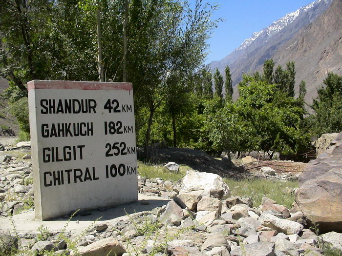

We were setting of for Shandur. This signpost was very near where we were staying in Mastuj.

## Comments (2)

**maria** - January 11, 2005 10:44 PM

meray piya gaye shandur
waha say aya un kaa yeh telephone
'tumhareee yaaad satatee hai
raat ko neend naa aatee hai'
meray piyaaaaaaaaaaaaaaaaaaaaaaaaaaaa

as hear from a friend's dadi (grandmother)

**Unkill Taam** - January 13, 2005  2:36 AM

Piya shaadi se pehle gaye thhay ya shaadi kay baad? Bcos in the latter case, the above verse would be mere fantasy - a nostalgic recollection of pre-marital bliss!!!

